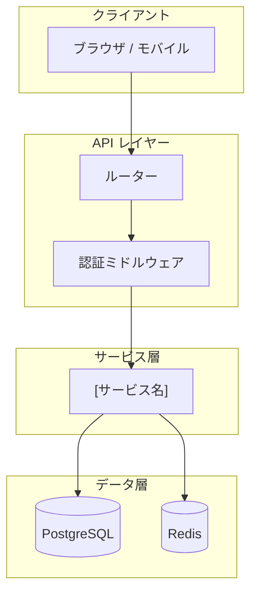
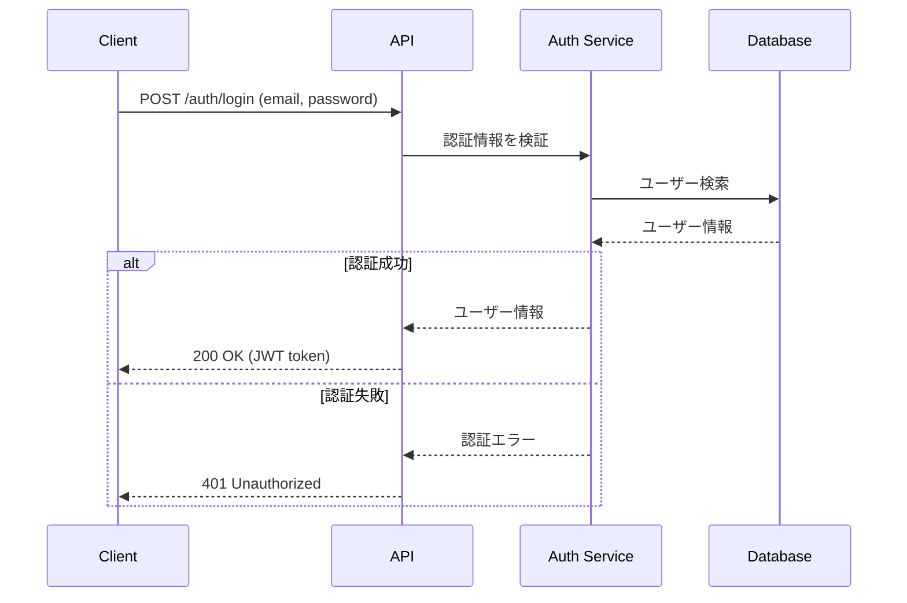
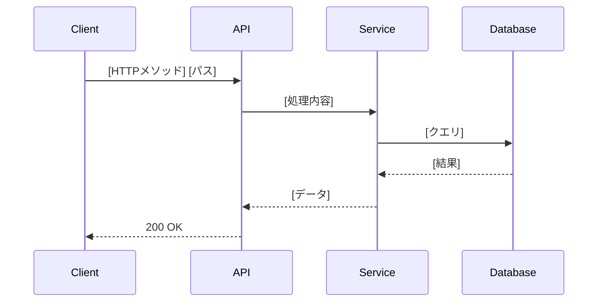
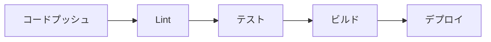
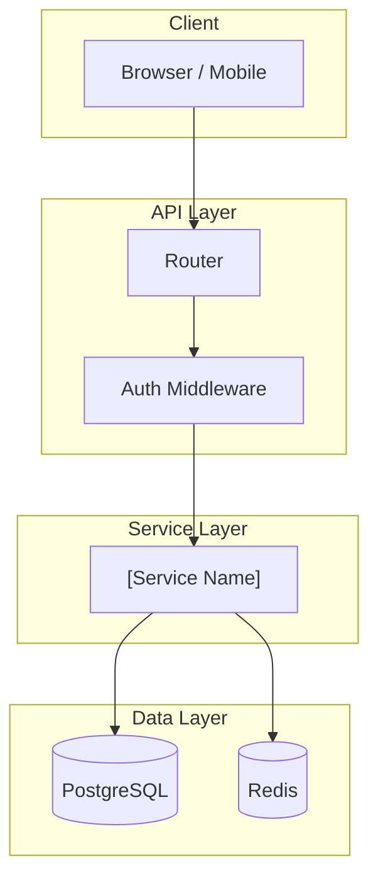
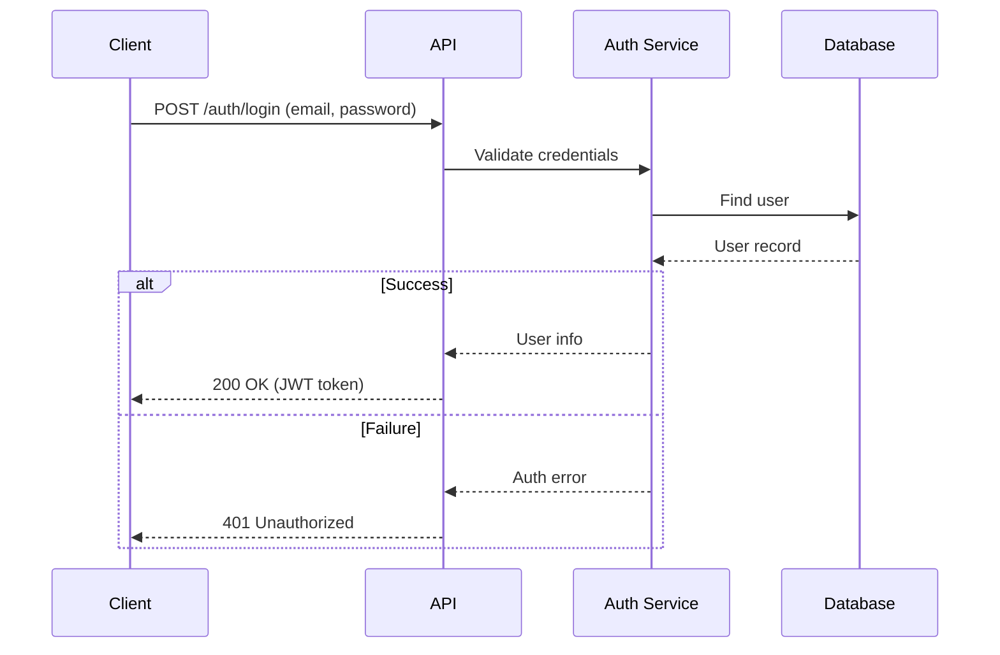
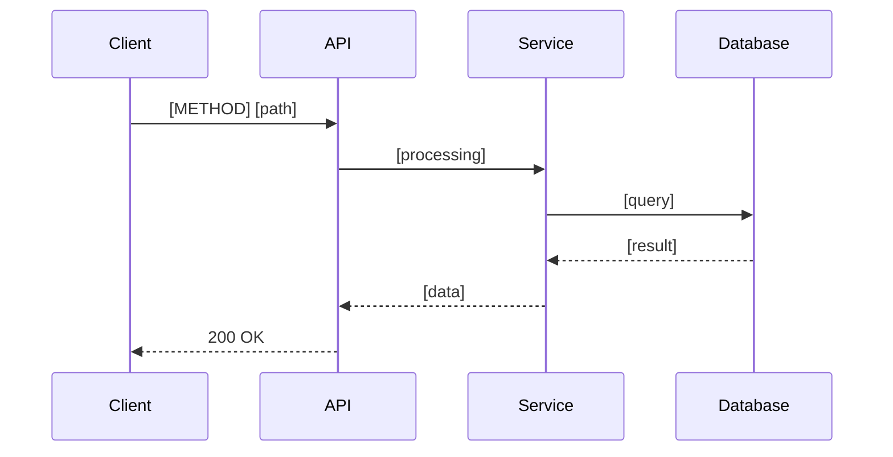
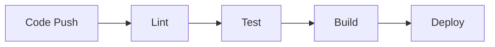

# リポジトリ設計調査 (Design Investigation)

API設計・データフロー・Mermaid 図（アーキテクチャ図・シーケンス図）および関連する横断的調査を行い、日本語レポートを生成します。

## Usage

```bash
/repo-investigate-design                    # カレントディレクトリを調査（デフォルト: 日本語）
/repo-investigate-design src/               # 特定パスを調査
/repo-investigate-design --lang ja          # 日本語レポートのみ（デフォルト）
/repo-investigate-design --lang en          # 英語レポートのみ
/repo-investigate-design --lang both        # 日英両方
/repo-investigate-design src/ --lang both   # パス指定 + 日英両方
```

## Language Detection

`$ARGUMENTS` から `--lang` フラグとターゲットパスを解析する。

```text
LANG_MODE = extract "--lang <value>" from $ARGUMENTS, default = "ja"
TARGET_DIR = remaining argument after removing --lang flag, default = "."
```

Supported values: `ja`, `en`, `both`

---

## Workflow

### Phase 1: API エンドポイント調査

HTTP ルート・コントローラー・ハンドラーを探索して API 一覧を作成する。

```bash
# ルート定義ファイルを探す
find "${TARGET_DIR:-.}" -maxdepth 5 -type f \
  | grep -E '(route|router|controller|handler|api)' \
  | grep -v -E '(node_modules|\.git|__pycache__|dist|build|test|spec)' \
  | head -30

# HTTP メソッド定義を Grep（フレームワーク別）

# FastAPI / Flask (Python)
grep -r "@app\.\(get\|post\|put\|patch\|delete\)\|@router\.\(get\|post\|put\|patch\|delete\)" \
  "${TARGET_DIR:-.}" --include="*.py" -l

# Express / Next.js (TypeScript/JavaScript)
grep -r "router\.\(get\|post\|put\|patch\|delete\)\|app\.\(get\|post\|put\|patch\|delete\)" \
  "${TARGET_DIR:-.}" --include="*.ts" --include="*.js" -l

# Go (net/http / Gin / Echo)
grep -r "http\.HandleFunc\|r\.GET\|r\.POST\|e\.GET\|e\.POST" \
  "${TARGET_DIR:-.}" --include="*.go" -l
```

ルートファイルを Read して各エンドポイントの詳細（メソッド・パス・ハンドラー・認証要否）を収集する。

**Output:**
- エンドポイント一覧（メソッド・パス・説明・認証要否）

**Done when:** 主要エンドポイントが網羅できた。

---

### Phase 2: データフロー分析

リクエストからレスポンスまでのデータの流れを追跡する。

```bash
# サービス層・リポジトリ層のファイルを探す
find "${TARGET_DIR:-.}" -maxdepth 5 -type f \
  | grep -E '(service|repository|repo|store|dao|usecase|domain)' \
  | grep -v -E '(node_modules|\.git|__pycache__|dist|build|test|spec)' \
  | head -20

# 外部サービス呼び出しを探す（HTTP クライアント・SDK）
grep -r "requests\.\|httpx\.\|axios\.\|fetch(\|http\.Get\|http\.Post" \
  "${TARGET_DIR:-.}" \
  --exclude-dir=node_modules --exclude-dir=.git --exclude-dir=dist \
  --exclude-dir=build --exclude-dir=__pycache__ --exclude-dir=.venv \
  --include="*.py" --include="*.ts" --include="*.go" -l

# キャッシュ・キュー・DB クライアントの使用箇所
grep -r "redis\.\|cache\.\|sqs\.\|rabbitmq\.\|kafka\." \
  "${TARGET_DIR:-.}" \
  --exclude-dir=node_modules --exclude-dir=.git --exclude-dir=dist \
  --exclude-dir=build --exclude-dir=__pycache__ --exclude-dir=.venv \
  --include="*.py" --include="*.ts" --include="*.go" -l
```

主要なサービスファイルを Read してデータ変換・バリデーション・副作用の処理を理解する。

**Output:**
- データフローの流れ（入力 → 変換 → 永続化 → 応答）
- 外部サービス依存関係

**Done when:** リクエスト〜レスポンスの主要フローが把握できた。

---

### Phase 3: アーキテクチャ図の生成

収集した情報を基に Mermaid flowchart でシステム全体像を描く。

以下の要素を含める（存在する場合のみ）:
- クライアント（ブラウザ / モバイル / 外部システム）
- API ゲートウェイ / ロードバランサー
- アプリケーションサーバー / API レイヤー
- サービス層・ビジネスロジック層
- データ層（DB・キャッシュ・ストレージ）
- 外部サービス（認証・決済・通知など）
- 非同期処理（キュー・Worker・バッチ）



**Done when:** アーキテクチャ図が実際のコードを反映している。

---

### Phase 4: シーケンス図の生成

主要なユースケースについて Mermaid sequenceDiagram を生成する。

以下の観点から 2〜4 つのシーケンスを選ぶ:

1. **認証フロー**（ログイン・トークン発行・リフレッシュ）— 認証実装がある場合
2. **主要 CRUD フロー**（最もよく使われるリソースの取得・作成）
3. **非同期処理フロー**（キュー投入 → Worker 処理 → 完了通知）— 非同期処理がある場合
4. **エラー処理フロー**（バリデーションエラー・外部サービス障害時）

各シーケンス図には以下を含める:
- アクター（Client, API, Service, Repository, DB, 外部サービス）
- 正常系の流れ
- 代表的な異常系（`alt` ブロック）


**Done when:** 主要フローのシーケンス図が生成できた。

---

### Phase 5: 横断的調査

#### 5-1: テスト構成

```bash
# テストファイルを探す
find "${TARGET_DIR:-.}" -maxdepth 5 -type f \
  | grep -E '(test|spec|__test__)' \
  | grep -v -E '(node_modules|\.git|dist|build)' \
  | head -30

# テストフレームワーク検出
grep -r "pytest\|unittest\|jest\|vitest\|go test\|rspec\|mocha" \
  "${TARGET_DIR:-.}" \
  --exclude-dir=node_modules --exclude-dir=.git --exclude-dir=dist \
  --exclude-dir=build --exclude-dir=__pycache__ --exclude-dir=.venv \
  --include="*.toml" --include="*.json" --include="*.yml" --include="*.yaml" -l
```

**Output:** テスト種別（Unit / Integration / E2E）・フレームワーク・カバレッジ傾向

#### 5-2: セキュリティパターン

```bash
# 認証・認可の実装を探す
grep -r "jwt\|bearer\|oauth\|session\|middleware.*auth\|auth.*middleware" \
  "${TARGET_DIR:-.}" \
  --exclude-dir=node_modules --exclude-dir=.git --exclude-dir=dist \
  --exclude-dir=build --exclude-dir=__pycache__ --exclude-dir=.venv \
  --include="*.py" --include="*.ts" --include="*.go" -l -i

# シークレット管理
find "${TARGET_DIR:-.}" -maxdepth 3 \( -name "*.env*" -o -name ".env*" \) \
  | grep -v -E '(node_modules|\.git)' | head -10

grep -r "os\.environ\|process\.env\|os\.Getenv\|secrets\." \
  "${TARGET_DIR:-.}" \
  --exclude-dir=node_modules --exclude-dir=.git --exclude-dir=dist \
  --exclude-dir=build --exclude-dir=__pycache__ --exclude-dir=.venv \
  --include="*.py" --include="*.ts" --include="*.go" -l | head -10
```

**Output:** 認証方式・認可パターン・シークレット管理方法

#### 5-3: 設定・環境変数管理

```bash
# 設定ファイルを探す
find "${TARGET_DIR:-.}" -maxdepth 3 -type f \
  | grep -E '\.(env|yaml|yml|toml|ini|conf)$' \
  | grep -v -E '(node_modules|\.git|dist|build)' | head -20
```

**Output:** 必要な環境変数一覧・設定ファイル一覧

#### 5-4: 可観測性（ログ・メトリクス・トレーシング）

```bash
# ロギング実装を探す
grep -r "logging\.\|logger\.\|log\.\|structlog\.\|winston\.\|zap\." \
  "${TARGET_DIR:-.}" \
  --exclude-dir=node_modules --exclude-dir=.git --exclude-dir=dist \
  --exclude-dir=build --exclude-dir=__pycache__ --exclude-dir=.venv \
  --include="*.py" --include="*.ts" --include="*.go" -l | head -10

# メトリクス・トレーシング
grep -r "prometheus\|statsd\|datadog\|opentelemetry\|jaeger\|zipkin" \
  "${TARGET_DIR:-.}" \
  --exclude-dir=node_modules --exclude-dir=.git --exclude-dir=dist \
  --exclude-dir=build --exclude-dir=__pycache__ --exclude-dir=.venv \
  --include="*.py" --include="*.ts" --include="*.go" \
  --include="*.toml" --include="*.json" -l | head -10
```

**Output:** ログ出力方式・メトリクス収集・トレーシング有無

#### 5-5: CI/CD パイプライン

```bash
# CI 設定ファイルを探す
find "${TARGET_DIR:-.}" -maxdepth 4 \
  \( -name "*.yml" -o -name "*.yaml" \) \
  | grep -E '(\.github|\.gitlab|\.circleci|bitbucket|jenkins|Jenkinsfile)' \
  | grep -v -E '(node_modules|\.git)' | head -10

ls -1 "${TARGET_DIR:-.}"/.github/workflows/ 2>/dev/null || true
```

CI 設定ファイルを Read してワークフローのステップを確認する。

**Output:** CI/CD ツール・ワークフロー概要（lint / test / build / deploy）

#### 5-6: エラーハンドリングパターン

```bash
# カスタム例外・エラー型を探す
grep -r "class.*Error\|class.*Exception\|type.*Error\|errors\.New\|fmt\.Errorf" \
  "${TARGET_DIR:-.}" \
  --exclude-dir=node_modules --exclude-dir=.git --exclude-dir=dist \
  --exclude-dir=build --exclude-dir=__pycache__ --exclude-dir=.venv \
  --include="*.py" --include="*.ts" --include="*.go" -l | head -10

# グローバルエラーハンドラーを探す
grep -r "exception_handler\|errorHandler\|middleware.*error\|error.*middleware" \
  "${TARGET_DIR:-.}" \
  --exclude-dir=node_modules --exclude-dir=.git --exclude-dir=dist \
  --exclude-dir=build --exclude-dir=__pycache__ --exclude-dir=.venv \
  --include="*.py" --include="*.ts" --include="*.go" -l | head -10
```

**Output:** エラー処理パターン・カスタムエラー型・グローバルエラーハンドラー

**Done when:** Phase 5 の全調査が完了した。

---

### Phase 6: レポート出力

出力先を LANG_MODE に基づいて決定し、Write ツールでファイルに保存する。

```text
If docs/ exists in TARGET_DIR:
  JA_FILE = "${TARGET_DIR}/docs/repo-design.ja.md"
  EN_FILE = "${TARGET_DIR}/docs/repo-design.en.md"
Else:
  JA_FILE = "${TARGET_DIR}/repo-design.ja.md"
  EN_FILE = "${TARGET_DIR}/repo-design.en.md"
```

- `--lang ja`   → JA_FILE のみ出力（デフォルト）
- `--lang en`   → EN_FILE のみ出力
- `--lang both` → JA_FILE と EN_FILE の両方を出力

出力後、生成ファイルのパスをユーザーに表示する。

---

## レポートテンプレート（日本語）

````markdown
# リポジトリ設計調査レポート: [プロジェクト名]

**日付**: YYYY-MM-DD
**調査対象**: [調査したパス]

---

## 1. アーキテクチャ図


---

## 2. データフロー

### リクエスト処理フロー

| フェーズ | 処理内容 | 担当コンポーネント |
|---------|---------|-----------------|
| 受信 | HTTP リクエスト受信・ルーティング | ルーター |
| 認証 | JWT / セッション検証 | 認証ミドルウェア |
| バリデーション | 入力値検証 | スキーマ / バリデーター |
| ビジネスロジック | コアロジック実行 | サービス層 |
| データ操作 | DB 読み書き | リポジトリ層 |
| 応答 | レスポンス生成・返却 | API レイヤー |

### 外部サービス依存

| サービス | 用途 | 呼び出し元 |
|---------|------|---------|
| | | |

---

## 3. API 設計一覧

| メソッド | パス | 説明 | 認証 | ハンドラー |
|---------|------|------|------|---------|
| GET | /api/v1/... | | 必要 / 不要 | |
| POST | /api/v1/... | | | |

---

## 4. シーケンス図

### 4.1 認証フロー



### 4.2 [主要フロー名]



---

## 5. テスト構成

| 種別 | フレームワーク | 対象 | カバレッジ傾向 |
|------|-------------|------|-------------|
| Unit | | | |
| Integration | | | |
| E2E | | | |

**観察事項:**
- テストが充実しているエリア: ...
- テストが不足しているエリア: ...

---

## 6. セキュリティパターン

| 項目 | 実装内容 |
|------|---------|
| 認証方式 | |
| 認可パターン | |
| シークレット管理 | |
| 入力バリデーション | |
| CORS / CSRF 対策 | |

---

## 7. 環境変数・設定管理

### 必要な環境変数

| 変数名 | 用途 | 必須 |
|--------|------|------|
| | | ✅ / ⚠️ |

### 設定ファイル

| ファイル | 用途 |
|---------|------|
| | |

---

## 8. 可観測性

| 項目 | 実装状況 | 使用ライブラリ / サービス |
|------|---------|----------------------|
| ロギング | | |
| メトリクス | | |
| トレーシング | | |
| ヘルスチェック | | |

---

## 9. エラーハンドリングパターン

| パターン | 使用箇所 | 説明 |
|---------|---------|------|
| グローバルハンドラー | | |
| カスタムエラー型 | | |
| リトライ処理 | | |

---

## 10. CI/CD パイプライン



| ステップ | ツール | 説明 |
|---------|-------|------|
| Lint | | |
| Test | | |
| Build | | |
| Deploy | | |

---

## 11. 課題・改善提案

- [ ] ...
- [ ] ...
````

---

## Report Template (English)

````markdown
# Repository Design Investigation: [Project Name]

**Date**: YYYY-MM-DD
**Target**: [path investigated]

---

## 1. Architecture Diagram



---

## 2. Data Flow

### Request Processing Flow

| Phase | Processing | Component |
|-------|-----------|-----------|
| Receive | HTTP request routing | Router |
| Auth | JWT / session validation | Auth Middleware |
| Validation | Input validation | Schema / Validator |
| Business Logic | Core logic execution | Service Layer |
| Data Access | DB read/write | Repository Layer |
| Response | Response generation | API Layer |

### External Service Dependencies

| Service | Purpose | Called From |
|---------|---------|------------|
| | | |

---

## 3. API Endpoints

| Method | Path | Description | Auth | Handler |
|--------|------|-------------|------|---------|
| GET | /api/v1/... | | Required / None | |
| POST | /api/v1/... | | | |

---

## 4. Sequence Diagrams

### 4.1 Authentication Flow



### 4.2 [Main Flow Name]



---

## 5. Test Structure

| Type | Framework | Scope | Coverage Trend |
|------|-----------|-------|----------------|
| Unit | | | |
| Integration | | | |
| E2E | | | |

**Observations:**
- Well-covered areas: ...
- Under-tested areas: ...

---

## 6. Security Patterns

| Item | Implementation |
|------|---------------|
| Authentication | |
| Authorization | |
| Secret Management | |
| Input Validation | |
| CORS / CSRF | |

---

## 7. Environment Variables & Configuration

### Required Environment Variables

| Variable | Purpose | Required |
|----------|---------|---------|
| | | ✅ / ⚠️ |

### Configuration Files

| File | Purpose |
|------|---------|
| | |

---

## 8. Observability

| Item | Status | Library / Service |
|------|--------|------------------|
| Logging | | |
| Metrics | | |
| Tracing | | |
| Health Check | | |

---

## 9. Error Handling Patterns

| Pattern | Location | Description |
|---------|---------|-------------|
| Global Handler | | |
| Custom Error Types | | |
| Retry Logic | | |

---

## 10. CI/CD Pipeline



| Step | Tool | Description |
|------|------|-------------|
| Lint | | |
| Test | | |
| Build | | |
| Deploy | | |

---

## 11. Findings & Improvement Suggestions

- [ ] ...
- [ ] ...
````

---

## Notes

- `node_modules`, `.git`, `dist`, `build`, `__pycache__` は全検索でスキップする。
- Mermaid 図はコードから読み取った実際の構成を反映すること（架空の構成を書かない）。
- シーケンス図は実際のエンドポイント・サービスの呼び出しコードを Read して生成すること。
- API 一覧は完全なリストより「主要エンドポイント」を優先（50件以上ある場合はグループ化）。
- `$ARGUMENTS` にパスのみ（`--lang` フラグなし）の場合、LANG_MODE = "ja" をデフォルトとする。
- 常に Write ツールでレポートを保存すること（stdout への出力のみは不可）。
- ファイル命名規則:
  - 日本語: `repo-design.ja.md`
  - 英語: `repo-design.en.md`
