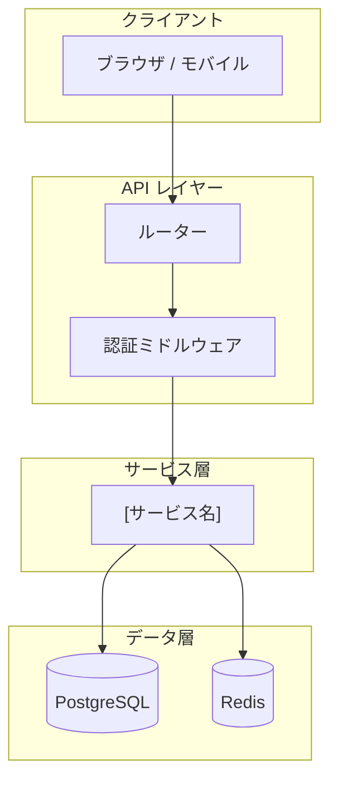
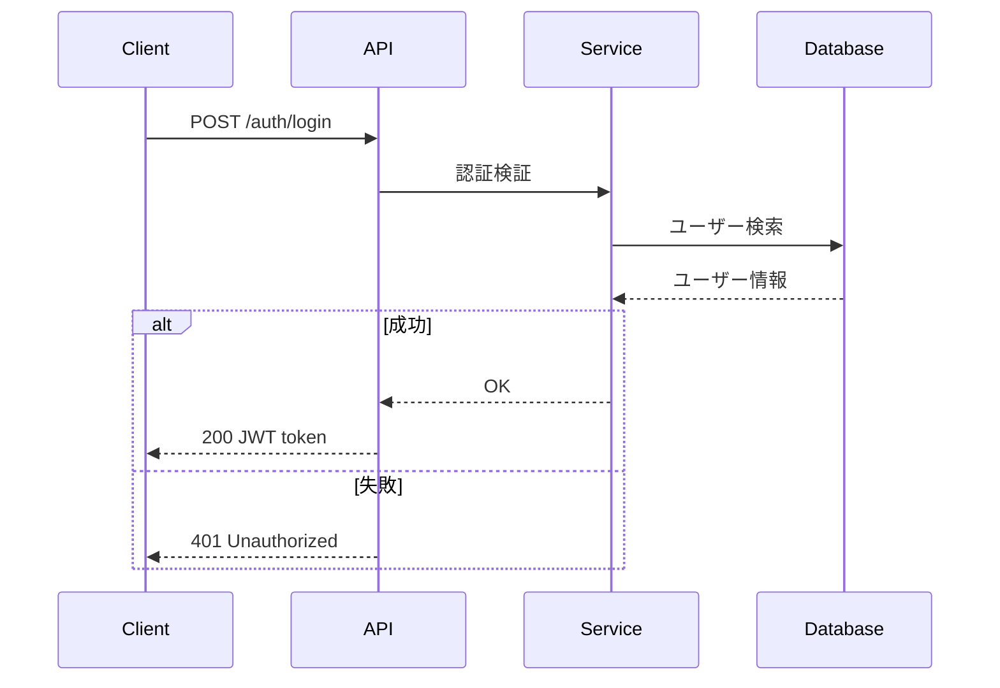

# リポジトリ調査フル (Full Repository Investigation)

`repo-investigate`（構造・依存関係）と `repo-investigate-design`（API設計・データフロー・Mermaid図）をワンショットで実行し、2つのレポートを生成します。

## Usage

```bash
/repo-investigate-full                    # カレントディレクトリを調査（デフォルト: 日本語）
/repo-investigate-full src/               # 特定パスを調査
/repo-investigate-full --lang ja          # 日本語レポートのみ（デフォルト）
/repo-investigate-full --lang en          # 英語レポートのみ
/repo-investigate-full --lang both        # 日英両方
/repo-investigate-full src/ --lang both   # パス指定 + 日英両方
```

## 生成ファイル

| ファイル | 内容 |
|---------|------|
| `repo-investigation.ja.md` | 構造・依存関係・エントリーポイント調査レポート |
| `repo-design.ja.md` | API設計・データフロー・Mermaid図・横断的調査レポート |

（`--lang en` の場合は `.en.md`、`--lang both` の場合は両言語）

## Language Detection

`$ARGUMENTS` から `--lang` フラグとターゲットパスを解析する。

```text
LANG_MODE = extract "--lang <value>" from $ARGUMENTS, default = "ja"
TARGET_DIR = remaining argument after removing --lang flag, default = "."
```

Supported values: `ja`, `en`, `both`

---

## Step 0: サブスキルの読み込み試行

以下の順番で Glob ツールを使い、各サブスキルの SKILL.md を検索して Read する。
見つかった場合はそのスキルの手順に従う。見つからない場合は本ファイルのインライン手順を使う。

```text
1. repo-investigate  — **/repo-investigate/SKILL.md
2. repo-investigate-design — **/repo-investigate-design/SKILL.md
```

> サブスキルが見つかった場合: そのスキルの Workflow セクションを Step 1・Step 2 として実行する。
> 見つからない場合: 以下のインライン手順（Phase 1〜9）を実行する。

---

## インライン手順（サブスキルが見つからない場合）

---

### Phase 1: プロジェクト概要

プロジェクトの種別と技術スタックを特定する。

```bash
# ルートファイルを確認
ls -1

# パッケージマネージャー / ビルドツールを検出
cat package.json        # Node.js
cat pyproject.toml      # Python
cat go.mod              # Go
cat Cargo.toml          # Rust
cat pom.xml             # Java/Maven
cat build.gradle        # Java/Gradle
```

**Output:**
- 言語 / フレームワーク
- ビルドツール / パッケージマネージャー
- 主要な設定ファイル

**Done when:** 技術スタックが特定できた。

---

### Phase 2: ディレクトリ構造

トップレベルのディレクトリレイアウトとモジュール境界を把握する。

```bash
# ディレクトリツリー（深さ 2〜3）
find ${TARGET_DIR:-.} -maxdepth 3 -type d \
  | grep -v -E '(node_modules|\.git|__pycache__|\.venv|dist|build|\.next)' \
  | sort

# 拡張子別ファイル数
find ${TARGET_DIR:-.} -type f \
  | grep -v -E '(node_modules|\.git|__pycache__|\.venv|dist|build)' \
  | sed 's/.*\.//' | sort | uniq -c | sort -rn | head -20
```

**Done when:** モジュール境界と全体レイアウトが明確になった。

---

### Phase 3: エントリーポイントとコアコンポーネント

エントリーポイント・メインモジュール・主要な抽象を特定する。

```bash
# 一般的なエントリーポイントパターン
find ${TARGET_DIR:-.} -maxdepth 3 -type f \
  | grep -E '(main\.|index\.|app\.|server\.|cmd/)' \
  | grep -v -E '(node_modules|\.git|test|spec)'
```

エントリーポイントファイルを Read して初期化フローとトップレベルのインポートを理解する。

**Done when:** エントリーポイントとコアモジュールが特定できた。

---

### Phase 4: 依存関係分析

外部依存関係と内部モジュール依存関係を分析する。

#### 外部依存関係

```bash
# Node.js
cat package.json | grep -A 100 '"dependencies"'

# Python
cat pyproject.toml || cat requirements.txt || cat Pipfile

# Go
cat go.mod

# Ruby
cat Gemfile
```

#### 内部依存関係

```bash
# インポートパターンを Grep（言語に応じてパターンを調整）
grep -r "^import\|^from\|^require\|^use " ${TARGET_DIR:-.} \
  --include="*.ts" --include="*.py" --include="*.go" \
  -l | head -30
```

**Done when:** 依存関係グラフが明確になった。

---

### Phase 5: API エンドポイント調査

HTTP ルート・コントローラー・ハンドラーを探索して API 一覧を作成する。

```bash
# ルート定義ファイルを探す
find ${TARGET_DIR:-.} -maxdepth 5 -type f \
  | grep -E '(route|router|controller|handler|api)' \
  | grep -v -E '(node_modules|\.git|__pycache__|dist|build|test|spec)' \
  | head -30

# FastAPI / Flask (Python)
grep -r "@app\.\(get\|post\|put\|patch\|delete\)\|@router\.\(get\|post\|put\|patch\|delete\)" \
  ${TARGET_DIR:-.} --include="*.py" -l

# Express / Next.js (TypeScript/JavaScript)
grep -r "router\.\(get\|post\|put\|patch\|delete\)\|app\.\(get\|post\|put\|patch\|delete\)" \
  ${TARGET_DIR:-.} --include="*.ts" --include="*.js" -l

# Go (net/http / Gin / Echo)
grep -r "http\.HandleFunc\|r\.GET\|r\.POST\|e\.GET\|e\.POST" \
  ${TARGET_DIR:-.} --include="*.go" -l
```

ルートファイルを Read して各エンドポイントの詳細（メソッド・パス・ハンドラー・認証要否）を収集する。

**Done when:** 主要エンドポイントが網羅できた。

---

### Phase 6: データフロー分析

リクエストからレスポンスまでのデータの流れを追跡する。

```bash
# サービス層・リポジトリ層のファイルを探す
find ${TARGET_DIR:-.} -maxdepth 5 -type f \
  | grep -E '(service|repository|repo|store|dao|usecase|domain)' \
  | grep -v -E '(node_modules|\.git|__pycache__|dist|build|test|spec)' \
  | head -20

# 外部サービス呼び出し
grep -r "requests\.\|httpx\.\|axios\.\|fetch(\|http\.Get\|http\.Post" \
  ${TARGET_DIR:-.} \
  --include="*.py" --include="*.ts" --include="*.go" -l

# キャッシュ・キュー・DB クライアント
grep -r "redis\.\|cache\.\|sqs\.\|rabbitmq\.\|kafka\." \
  ${TARGET_DIR:-.} \
  --include="*.py" --include="*.ts" --include="*.go" -l
```

**Done when:** リクエスト〜レスポンスの主要フローが把握できた。

---

### Phase 7: Mermaid 図の生成

#### 7-1: アーキテクチャ図

収集した情報を基に Mermaid flowchart でシステム全体像を描く（実際の構成のみ記載）。



#### 7-2: シーケンス図

主要なユースケース 2〜4 つについて Mermaid sequenceDiagram を生成する:

1. 認証フロー（認証実装がある場合）
2. 主要 CRUD フロー
3. 非同期処理フロー（非同期処理がある場合）
4. エラー処理フロー



**Done when:** アーキテクチャ図とシーケンス図が生成できた。

---

### Phase 8: 横断的調査

#### 8-1: テスト構成

```bash
find ${TARGET_DIR:-.} -maxdepth 5 -type f \
  | grep -E '(test|spec|__test__)' \
  | grep -v -E '(node_modules|\.git|dist|build)' \
  | head -30

grep -r "pytest\|unittest\|jest\|vitest\|rspec\|mocha" \
  ${TARGET_DIR:-.} \
  --include="*.toml" --include="*.json" --include="*.yml" -l
```

#### 8-2: セキュリティパターン

```bash
grep -r "jwt\|bearer\|oauth\|session\|auth.*middleware" \
  ${TARGET_DIR:-.} \
  --include="*.py" --include="*.ts" --include="*.go" -l -i | head -10

find ${TARGET_DIR:-.} -maxdepth 3 \( -name "*.env*" -o -name ".env*" \) \
  | grep -v -E '(node_modules|\.git)' | head -10
```

#### 8-3: 設定・環境変数管理

```bash
find ${TARGET_DIR:-.} -maxdepth 3 -type f \
  | grep -E '\.(env|yaml|yml|toml|ini|conf)$' \
  | grep -v -E '(node_modules|\.git|dist|build)' | head -20
```

#### 8-4: 可観測性

```bash
grep -r "logging\.\|logger\.\|structlog\.\|winston\.\|zap\." \
  ${TARGET_DIR:-.} \
  --include="*.py" --include="*.ts" --include="*.go" -l | head -10

grep -r "prometheus\|opentelemetry\|datadog\|jaeger" \
  ${TARGET_DIR:-.} \
  --include="*.py" --include="*.ts" --include="*.go" \
  --include="*.toml" --include="*.json" -l | head -10
```

#### 8-5: CI/CD パイプライン

```bash
find ${TARGET_DIR:-.} -maxdepth 4 \
  \( -name "*.yml" -o -name "*.yaml" \) \
  | grep -E '(\.github|\.gitlab|\.circleci|Jenkinsfile)' \
  | grep -v -E '(node_modules|\.git)' | head -10

ls -1 ${TARGET_DIR:-.}/.github/workflows/ 2>/dev/null || true
```

#### 8-6: エラーハンドリングパターン

```bash
grep -r "class.*Error\|class.*Exception\|errors\.New\|fmt\.Errorf" \
  ${TARGET_DIR:-.} \
  --include="*.py" --include="*.ts" --include="*.go" -l | head -10

grep -r "exception_handler\|errorHandler\|middleware.*error" \
  ${TARGET_DIR:-.} \
  --include="*.py" --include="*.ts" --include="*.go" -l | head -10
```

**Done when:** Phase 8 の全調査が完了した。

---

### Phase 9: レポート出力

出力先を LANG_MODE に基づいて決定し、Write ツールで2つのファイルに保存する。

```text
If docs/ exists in TARGET_DIR:
  INVESTIGATION_JA = "${TARGET_DIR}/docs/repo-investigation.ja.md"
  DESIGN_JA        = "${TARGET_DIR}/docs/repo-design.ja.md"
  INVESTIGATION_EN = "${TARGET_DIR}/docs/repo-investigation.en.md"
  DESIGN_EN        = "${TARGET_DIR}/docs/repo-design.en.md"
Else:
  INVESTIGATION_JA = "${TARGET_DIR}/repo-investigation.ja.md"
  DESIGN_JA        = "${TARGET_DIR}/repo-design.ja.md"
  INVESTIGATION_EN = "${TARGET_DIR}/repo-investigation.en.md"
  DESIGN_EN        = "${TARGET_DIR}/repo-design.en.md"
```

出力ルール:
- `--lang ja`   → INVESTIGATION_JA + DESIGN_JA のみ出力（デフォルト）
- `--lang en`   → INVESTIGATION_EN + DESIGN_EN のみ出力
- `--lang both` → 4ファイル全て出力

**repo-investigation ファイル（構造・依存関係レポート）:**
Phase 1〜4 の調査結果をまとめる。テンプレートは repo-investigate スキルの日本語テンプレートに準拠する。

**repo-design ファイル（設計・図レポート）:**
Phase 5〜8 の調査結果をまとめる。テンプレートは repo-investigate-design スキルの日本語テンプレートに準拠する。

出力後、以下の形式で完了サマリーを表示する:

```text
✅ repo-investigate-full 完了 — {生成ファイル数}ファイルを生成しました

【構造・依存関係】
📁 repo-investigation.ja.md  — ディレクトリ構造・エントリーポイント・依存関係

【設計・アーキテクチャ】
🏗️  repo-design.ja.md         — API設計・データフロー・Mermaid図・横断的調査

出力先: {ファイルパスの一覧}
```

---

## Notes

- `node_modules`, `.git`, `dist`, `build`, `__pycache__` は全検索でスキップする。
- Mermaid 図はコードから読み取った実際の構成を反映すること（架空の構成を書かない）。
- シーケンス図は実際のエンドポイント・サービスコードを Read して生成すること。
- API 一覧は完全なリストより「主要エンドポイント」を優先（50件以上はグループ化）。
- `$ARGUMENTS` にパスのみ（`--lang` フラグなし）の場合、LANG_MODE = "ja" をデフォルトとする。
- 常に Write ツールでレポートを保存すること（stdout への出力のみは不可）。
- モノレポの場合は Phase 2〜8 をワークスペース下の各パッケージに適用する。
