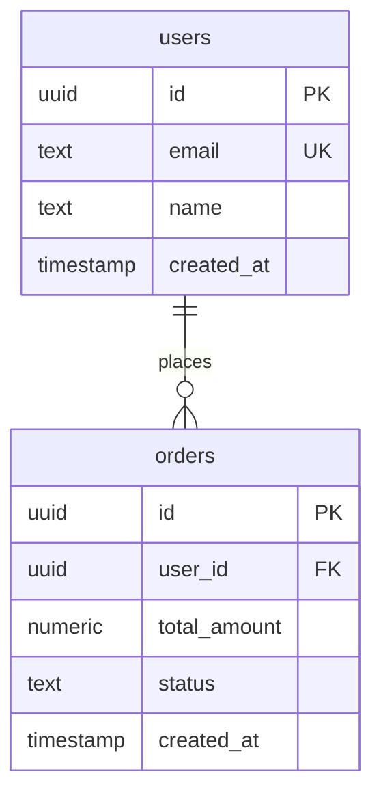

**入力は2パターン対応**:
1. `02.design-doc.md`（req-estimate スキルの出力）
2. 生の要件定義書 / readme

## Trigger Conditions
次のような状況で必ず使うこと:
- 「DB設計して」「テーブル設計して」「ER図を作って」
- 「RDS か DynamoDB どっちがいい？」「DB選定して」
- 「マイグレーション方針を決めたい」
- 02.design-doc.md を渡されたとき（DB設計が含まれていない場合）
- req-estimate の後続工程として DB設計が必要なとき

## Steps

### Step 1: 入力の種類を判定する

入力ファイルを読み込み、以下を確認する:
- **02.design-doc.md の場合**: 「システム概要」「機能要件」「アーキテクチャ図」が含まれる → Step 2 へ
- **raw 要件書の場合**: 機能リストや要件が書かれた markdown / テキスト → Step 2 へ（同じ処理）

どちらの場合も、以下を抽出する:
```
- システム名・目的
- 主要な機能（CRUD 操作が発生するエンティティを推測）
- ユーザーの種類・ロール
- 外部サービス連携（OAuth, 決済, etc.）
- 非機能要件（スケール感・アクセス頻度・データ量の目安）
```

### Step 2: データモデルを設計する

抽出した情報から **エンティティ** と **リレーション** を定義する。

**エンティティ特定のヒント**:
- 名詞で管理されるもの（ユーザー、商品、注文、メッセージ、etc.）
- 「一覧表示したい」「検索したい」「履歴を残したい」と書かれているもの
- 認証情報、ログ、設定値

**リレーション整理**:
- 1:N の関係（ユーザー:注文、親:子）
- N:M の関係（ユーザー:タグ → 中間テーブルが必要）
- 1:1 の関係（ユーザー:プロフィール）

### Step 3: AWS DBサービスを選定する

以下の判定フローで選定し、**根拠を必ず明記**する:

```
Q1: データに複雑なリレーション（JOIN）が必要か？
  YES → RDS / Aurora へ
  NO  → Q2 へ

Q2: スケールが予測困難、または 書き込みが高頻度（>1万件/秒）か？
  YES → DynamoDB へ
  NO  → Q3 へ

Q3: 高可用性・自動フェイルオーバーが必要か？（本番・中規模以上）
  YES → Aurora PostgreSQL Serverless v2
  NO  → RDS PostgreSQL（AWS RDS サポート済み最新安定版。WebSearch で確認すること）（t3.medium〜）
```

**選定結果テンプレート**:
```
| サービス | 理由 | 代替案 |
|---------|------|--------|
| Aurora PostgreSQL Serverless v2 | リレーショナルデータが中心、自動スケール必要 | RDS PostgreSQL（最新安定版）（コスト優先時） |
```

### Step 4: テーブル定義を作成する

各テーブルについて以下を定義する:

**必須カラム（全テーブル共通）**:
```
id          UUID PRIMARY KEY DEFAULT gen_random_uuid()
created_at  TIMESTAMP WITH TIME ZONE NOT NULL DEFAULT NOW()
updated_at  TIMESTAMP WITH TIME ZONE NOT NULL DEFAULT NOW()
```

**カラム設計の方針**:
- 文字列は `VARCHAR(n)` より `TEXT` を原則とする（PostgreSQL では性能差なし）
- 金額は `NUMERIC(12, 2)` または `INTEGER`（円単位）
- 外部キーは `_id` サフィックス、必ず `REFERENCES` 制約を付ける
- 論理削除は `deleted_at TIMESTAMP WITH TIME ZONE`（NULL = 未削除）
- ステータスは `TEXT` + CHECK 制約 または ENUM 型

**インデックス設計の方針**:
- 検索条件に頻繁に使うカラム（`user_id`, `status`, `created_at`）
- 外部キーには必ずインデックスを作成
- 複合インデックスはカーディナリティの高い順に並べる
- `UNIQUE` 制約はインデックスを兼ねる

### Step 5: ER図を作成する（Mermaid erDiagram）

Mermaid の `erDiagram` 記法を使用する。

**書き方の規則**:


**リレーション記号**:
```
||--||   1対1
||--o{   1対多（0以上）
||--|{   1対多（1以上）
}o--o{   多対多（中間テーブル経由は別途記載）
```

**図の作成ルール**:
- 全テーブルを1枚のダイアグラムに含める
- PK / FK / UK を明記する
- カラムは代表的なもの（5〜8個）に絞る（全カラムは Step 4 のテーブル定義に記載）

> ⚠️ **Mermaid erDiagram の FK UK 制約** : 1カラムに指定できるキー種別は **1つのみ**（`FK UK` の複合指定は構文エラー）。
> FK かつ UNIQUE にしたい場合は、キー種別を `FK` に固定し、UNIQUE である旨をコメント文字列に記載する:
> ```
> uuid user_id FK "UNIQUE - 1ユーザー1レコード"
> ```

### Step 6: マイグレーション方針を記載する

Python + AWS 構成を前提に以下を記載する:

**ツール選定**:
- Python バックエンド → **Alembic**（SQLAlchemy と組み合わせ）
- マイグレーションファイルは `migrations/versions/` に自動生成

**ディレクトリ構成**（例）:
```
backend/
├── alembic.ini
├── migrations/
│   ├── env.py
│   └── versions/
│       └── 0001_initial_schema.py
└── app/
    └── models/       # SQLAlchemy ORM モデル
```

**運用フロー**:
```
開発時:   alembic revision --autogenerate -m "add_users_table"
適用:     alembic upgrade head
ロールバック: alembic downgrade -1
```

**AWS 本番環境での適用方針**:
- ECS タスク起動時に `alembic upgrade head` を実行（init container）
- または CodePipeline の Deploy ステージに組み込む
- マイグレーション失敗時は ECS タスク起動を止める（ヘルスチェック連携）

### Step 7: 03.db-design.md を出力する

以下のテンプレートに従ってファイルを生成する。

---

## Output Templates

### 03.db-design.md

```markdown
# DB設計書 — {システム名}

**生成日**: {日付}
**対象スタック**: Python (SQLAlchemy / Alembic) + PostgreSQL（Aurora / RDS、採用結果に準拠）

---

## 1. AWS DBサービス選定

### 選定結果

| サービス | 採用理由 | 代替案 |
|---------|---------|--------|
| {サービス名} | {理由} | {代替案} |

### 選定根拠

{Step 3 の判定フローに基づいた詳細説明}

---

## 2. ER図

```mermaid
erDiagram
    {Step 5 の Mermaid コード}
```

---

## 3. テーブル定義

### {テーブル名1}

**概要**: {このテーブルの役割}

| カラム名 | 型 | 制約 | 説明 |
|---------|---|------|------|
| id | UUID | PK, DEFAULT gen_random_uuid() | 主キー |
| ... | ... | ... | ... |

**インデックス**:
```sql
CREATE INDEX idx_{table}_{column} ON {table}({column});
```

### {テーブル名2}
...（全テーブル分繰り返し）

---

## 4. マイグレーション方針

### ツール: Alembic

{Step 6 の内容}

### ディレクトリ構成

{コードブロック}

### 本番環境での適用手順

{コードブロック}

---

## 5. 設計上の判断・注意事項

- {設計で迷った点・理由付きで採用した方針}
- {将来の拡張に備えた設計上の考慮}
- {パフォーマンス上の注意点}
```

---

## Quality Checklist

出力前に以下をすべて確認する:

- [ ] erDiagram に全テーブルが含まれているか
- [ ] 全テーブルに `id`, `created_at`, `updated_at` があるか
- [ ] 外部キーに対応するインデックスが定義されているか
- [ ] AWS DBサービスの選定根拠が明記されているか
- [ ] Alembic の運用フローが記載されているか
- [ ] 設計上の判断・トレードオフが記載されているか
- [ ] Mermaid の `erDiagram` 構文エラーがないか（FK は `FK` と明記）
- [ ] 1カラムに `FK UK` を複合指定していないか（構文エラーになる。UNIQUE はコメント文字列へ移動すること）
- [ ] データ移行・インポート仕様がある場合、実際のソースデータのJSONキー名を確認して使用しているか
