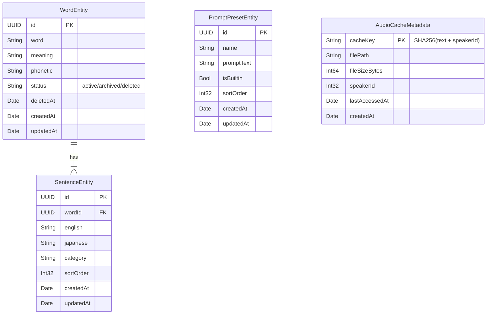

# DB設計書 — EnglishLearnApp iOS版

**生成日**: 2026-03-20
**対象スタック**: iOS 17.0 / Swift / CoreData（または SQLite + GRDB）

> iOS版はオフライン優先設計のため、ローカルストレージとして **CoreData**（または GRDB + SQLite）を採用します。データのバックアップ・移行には JSON エクスポート形式（`word_set.json`）を使用し、Web版・将来のクラウド同期との互換性を維持します。

---

## 1. ストレージ選定

### 選定結果

| ストレージ | 用途 | 採用理由 |
|-----------|------|---------|
| **CoreData** | 単語・例文・プロンプトプリセット | リレーション管理・Xcode統合・NSFetchedResultsController対応 |
| **FileManager + JSON** | データエクスポート / インポート | iOS版 word_set.json 互換性・バックアップ・デバイス移行 |
| **UserDefaults** | アプリ設定（音声設定・再生モードなど） | 軽量な設定値の永続化 |
| **FileManager（WAVキャッシュ）** | VOICEVOX 生成音声キャッシュ | バイナリファイルはDocuments配下に保存 |

### 選定根拠

- Q1: オフライン動作が必要か？ → **YES**（ネット接続なしで単語閲覧・音声再生）
- Q2: リレーション（JOIN）が必要か？ → **YES**（words → sentences の 1:N）
- Q3: Xcode / SwiftUI との統合が必要か？ → **YES**（NSFetchedResultsController / @FetchRequest）
- **結論**: CoreData でリレーショナルデータを管理。設定は UserDefaults、音声は FileManager

---

## 2. ER図



---

## 3. CoreData エンティティ定義

### WordEntity

**概要**: 英単語マスター。status で active / archived / deleted を管理

| 属性名 | 型 | オプション | 説明 |
|--------|---|-----------|------|
| id | UUID | No | 主キー（`UUID()` で自動生成） |
| word | String | No | 英単語 |
| meaning | String | No | 日本語訳 |
| phonetic | String | Yes | 発音記号 |
| status | String | No | `active` / `archived` / `deleted`（デフォルト: `active`） |
| deletedAt | Date | Yes | NULL=未削除、10日後にバッチ物理削除対象 |
| createdAt | Date | No | 登録日時 |
| updatedAt | Date | No | 更新日時 |

**リレーション**: `sentences` → [SentenceEntity]（To-Many, Cascade delete）

**インデックス（NSFetchRequest最適化）**:
- `status` — フィルタ条件として頻繁に使用
- `word` — アルファベット順ソート・全文検索

---

### SentenceEntity

**概要**: 例文。JSON エクスポート時は `sentences[]` 配列として出力

| 属性名 | 型 | オプション | 説明 |
|--------|---|-----------|------|
| id | UUID | No | 主キー |
| english | String | No | 英語例文（JSONキー: `english`） |
| japanese | String | No | 日本語訳（JSONキー: `japanese`） |
| category | String | Yes | カテゴリ（JSONキー: `category`） |
| sortOrder | Int32 | No | 表示順（デフォルト: 0） |
| createdAt | Date | No | 登録日時 |
| updatedAt | Date | No | 更新日時 |

**リレーション**: `word` → WordEntity（To-One, Nullify）

---

### PromptPresetEntity

**概要**: OpenAI 例文生成プロンプトプリセット（ユーザーカスタム + 組み込み）

| 属性名 | 型 | オプション | 説明 |
|--------|---|-----------|------|
| id | UUID | No | 主キー |
| name | String | No | プリセット名 |
| promptText | String | No | プロンプト本文 |
| isBuiltin | Bool | No | 組み込みフラグ（デフォルト: false） |
| sortOrder | Int32 | No | 表示順 |
| createdAt | Date | No | 登録日時 |
| updatedAt | Date | No | 更新日時 |

---

### AudioCacheMetadata（CoreData エンティティ）

**概要**: VOICEVOX 生成 WAV のメタデータ。実ファイルは `Documents/AudioCache/` に保存

| 属性名 | 型 | オプション | 説明 |
|--------|---|-----------|------|
| cacheKey | String | No | `SHA256(text + "_" + speakerId)`（ユニーク） |
| filePath | String | No | `Documents/AudioCache/<cacheKey>.wav` |
| fileSizeBytes | Int64 | Yes | ファイルサイズ（バイト） |
| speakerId | Int32 | No | VOICEVOX 話者 ID |
| lastAccessedAt | Date | No | LRU キャッシュ削除用 |
| createdAt | Date | No | 生成日時 |

---

## 4. JSON エクスポート / インポート仕様

iOS版 word_set.json 形式（Web版・将来の Cloud Sync との互換性）:

```json
{
  "version": 1,
  "exportedAt": "2026-03-20T10:00:00Z",
  "words": [
    {
      "id": "550e8400-e29b-41d4-a716-446655440000",
      "word": "ephemeral",
      "meaning": "一時的な、はかない",
      "phonetic": "/ɪˈfem.ər.əl/",
      "status": "active",
      "sentences": [
        {
          "id": "660e8400-e29b-41d4-a716-446655440001",
          "english": "The ephemeral beauty of cherry blossoms.",
          "japanese": "桜のはかない美しさ。",
          "category": "nature",
          "sortOrder": 0
        }
      ]
    }
  ]
}
```

**互換フィールド（Web版と一致）**: `word`, `meaning`, `phonetic`, `english`, `japanese`, `category`, `sortOrder`

---

## 5. UserDefaults キー設計

| キー | 型 | デフォルト | 説明 |
|------|---|-----------|------|
| `ttsVoice` | String | `"default"` | TTS 音声種別（default/female/male/voicevox） |
| `voicevoxStyle` | String | `"normal"` | VOICEVOX スタイル |
| `playbackMode` | String | `"bilingual"` | 連続再生モード（bilingual/english_only） |
| `playbackInterval` | Double | `1.0` | 例文間の間隔（秒） |
| `selectedPresetId` | String? | `nil` | 選択中のプロンプトプリセット UUID |
| `audioCacheMaxSizeMB` | Int | `200` | キャッシュ上限サイズ（MB） |

---

## 6. 設計上の判断・注意事項

- **CoreData vs GRDB**: 小〜中規模の個人アプリには CoreData が適切。複雑なクエリが増える場合は GRDB（SQLite）への移行を検討
- **ソフトデリート**: `deletedAt` で管理。削除後 10 日間は復元可能。バックグラウンドタスク（BGTaskScheduler）で物理削除
- **JSON 互換性**: iOS版エクスポートの UUID は Web版インポートで UPSERT に使用。`id` フィールドを必ず保持すること
- **キャッシュ管理**: `lastAccessedAt` で LRU 削除。上限（200MB デフォルト）超過時は古い順に削除
- **NSFetchedResultsController**: WordEntity のフェッチには `sectionNameKeyPath` で頭文字グループ化を設定し、UITableView / List と連動
