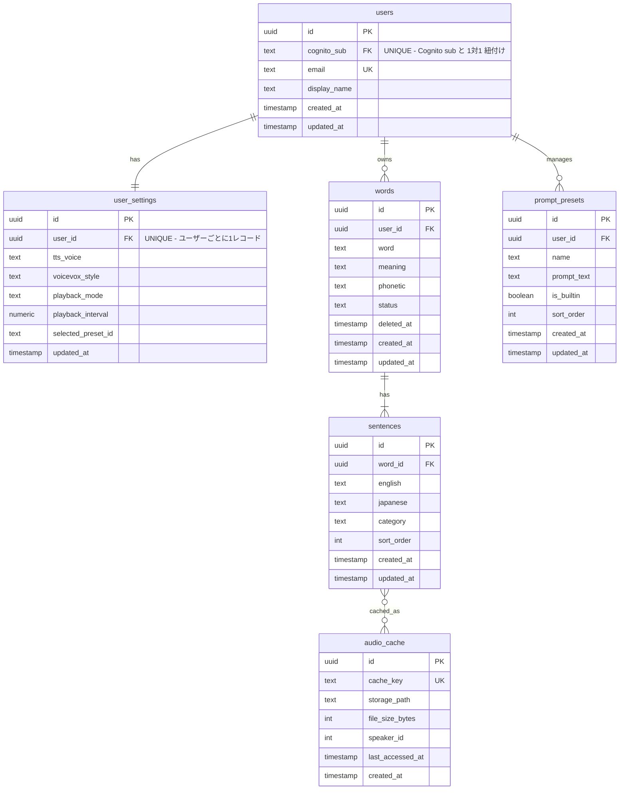

# DB設計書 — EnglishLearnApp Web版

**生成日**: 2026-03-20
**対象スタック**: Python (SQLAlchemy 2.x / Alembic) + PostgreSQL 16.x（RDS）

> Web版は iOS版と異なり、**クラウド DB（RDS PostgreSQL）が必須**です。
> ユーザーデータはすべてサーバー側に保存され、複数デバイス間で自動同期されます。
> iOS版（case1/app/db-design.md）と同一のスキーマを採用し、JSON エクスポート互換性を維持します。

---

## 1. AWS DBサービス選定

### 選定結果

| サービス | 採用理由 | 代替案 |
|---------|---------|--------|
| RDS PostgreSQL 16.x（t3.medium） | リレーショナルデータが中心（User 1:N Word 1:N Sentence）、MVP 段階は中小規模、複雑 JOIN が必要 | Aurora PostgreSQL Serverless v2（高可用性が必要な本番環境へのアップグレードパス） |

### 選定根拠

- Q1: データに複雑なリレーション（JOIN）が必要か？ → **YES**（users → words → sentences の 3 層リレーション、カテゴリ横断検索）
- Q2: スケールが予測困難 or 書き込みが高頻度か？ → **NO**（個人ユーザー起点、書き込みは単語追加・例文保存時のみ）
- Q3: 高可用性・自動フェイルオーバーが必要か？ → **MVP 段階では NO**（t3.medium シングル構成で開始）
- **結論**: **RDS PostgreSQL 16.x（t3.medium）** で開始。利用者増加時に Aurora Serverless v2 へ移行

---

## 2. ER図



---

## 3. テーブル定義

### users

**概要**: アプリユーザー。Cognito の sub（UUID）と紐付け。メールアドレスは UNIQUE

| カラム名 | 型 | 制約 | 説明 |
|---------|---|------|------|
| id | UUID | PK, DEFAULT gen_random_uuid() | 主キー |
| cognito_sub | TEXT | NOT NULL, UNIQUE | Cognito ユーザープール sub |
| email | TEXT | NOT NULL, UNIQUE | ログイン用メールアドレス |
| display_name | TEXT | | 表示名 |
| created_at | TIMESTAMPTZ | NOT NULL, DEFAULT NOW() | 作成日時 |
| updated_at | TIMESTAMPTZ | NOT NULL, DEFAULT NOW() | 更新日時 |

**インデックス**:
```sql
CREATE UNIQUE INDEX idx_users_cognito_sub ON users(cognito_sub);
CREATE UNIQUE INDEX idx_users_email ON users(email);
```

---

### user_settings

**概要**: ユーザーごとのアプリ設定。iOS版の UserDefaults に相当

| カラム名 | 型 | 制約 | 説明 |
|---------|---|------|------|
| id | UUID | PK, DEFAULT gen_random_uuid() | 主キー |
| user_id | UUID | FK → users.id, NOT NULL | "UNIQUE - ユーザーごとに1レコード" |
| tts_voice | TEXT | NOT NULL, DEFAULT 'default' | TTS 音声種別（default/female/male/voicevox） |
| voicevox_style | TEXT | NOT NULL, DEFAULT 'normal' | VOICEVOX スタイル（normal/amaama/etc.） |
| playback_mode | TEXT | NOT NULL, DEFAULT 'bilingual' | 連続再生モード（bilingual/english_only） |
| playback_interval | NUMERIC(3,1) | NOT NULL, DEFAULT 1.0 | 例文間の間隔（秒） |
| selected_preset_id | UUID | NULL | 選択中のプロンプトプリセット ID |
| updated_at | TIMESTAMPTZ | NOT NULL, DEFAULT NOW() | 更新日時 |

**インデックス**:
```sql
CREATE UNIQUE INDEX idx_user_settings_user_id ON user_settings(user_id);
```

---

### words

**概要**: 英単語マスター。iOS版 JSON の `word`, `meaning`, `phonetic` キーと対応

| カラム名 | 型 | 制約 | 説明 |
|---------|---|------|------|
| id | UUID | PK, DEFAULT gen_random_uuid() | 主キー（iOS版エクスポートの id と一致させる） |
| user_id | UUID | FK → users.id, NOT NULL | 所有ユーザー |
| word | TEXT | NOT NULL | 英単語（JSONキー: `word`） |
| meaning | TEXT | NOT NULL | 日本語訳（JSONキー: `meaning`） |
| phonetic | TEXT | | 発音記号（JSONキー: `phonetic`） |
| status | TEXT | NOT NULL, CHECK IN ('active','archived','deleted'), DEFAULT 'active' | 管理状態 |
| deleted_at | TIMESTAMPTZ | NULL | NULL=未削除、10日後バッチ物理削除対象 |
| created_at | TIMESTAMPTZ | NOT NULL, DEFAULT NOW() | |
| updated_at | TIMESTAMPTZ | NOT NULL, DEFAULT NOW() | |

**インデックス**:
```sql
CREATE INDEX idx_words_user_id ON words(user_id);
CREATE INDEX idx_words_user_status ON words(user_id, status);
CREATE INDEX idx_words_deleted_at ON words(deleted_at) WHERE deleted_at IS NOT NULL;
-- 全文検索用（pg_trgm 拡張を利用）
CREATE INDEX idx_words_search ON words USING gin((word || ' ' || meaning || ' ' || COALESCE(phonetic,'')) gin_trgm_ops);
```

---

### sentences

**概要**: 例文。iOS版 JSON の `sentences[].english`, `.japanese`, `.category` キーと対応

| カラム名 | 型 | 制約 | 説明 |
|---------|---|------|------|
| id | UUID | PK, DEFAULT gen_random_uuid() | 主キー |
| word_id | UUID | FK → words.id, NOT NULL | 紐づく単語 |
| english | TEXT | NOT NULL | 英語例文（JSONキー: `english`） |
| japanese | TEXT | NOT NULL | 日本語訳（JSONキー: `japanese`） |
| category | TEXT | | カテゴリ（JSONキー: `category`） |
| sort_order | INTEGER | NOT NULL, DEFAULT 0 | 表示順 |
| created_at | TIMESTAMPTZ | NOT NULL, DEFAULT NOW() | |
| updated_at | TIMESTAMPTZ | NOT NULL, DEFAULT NOW() | |

**インデックス**:
```sql
CREATE INDEX idx_sentences_word_id ON sentences(word_id);
CREATE INDEX idx_sentences_category ON sentences(category);
```

---

### prompt_presets

**概要**: OpenAI 例文生成プロンプトプリセット（ユーザーごと最大 10 件）

| カラム名 | 型 | 制約 | 説明 |
|---------|---|------|------|
| id | UUID | PK, DEFAULT gen_random_uuid() | 主キー |
| user_id | UUID | FK → users.id | NULL = 全ユーザー共通の組み込みプリセット |
| name | TEXT | NOT NULL | プリセット名 |
| prompt_text | TEXT | NOT NULL | プロンプト本文 |
| is_builtin | BOOLEAN | NOT NULL, DEFAULT FALSE | 組み込みフラグ |
| sort_order | INTEGER | NOT NULL, DEFAULT 0 | 表示順 |
| created_at | TIMESTAMPTZ | NOT NULL, DEFAULT NOW() | |
| updated_at | TIMESTAMPTZ | NOT NULL, DEFAULT NOW() | |

**インデックス**:
```sql
CREATE INDEX idx_prompt_presets_user_id ON prompt_presets(user_id);
```

---

### audio_cache

**概要**: VOICEVOX 生成 WAV のメタデータ（iOS版と同一設計）

| カラム名 | 型 | 制約 | 説明 |
|---------|---|------|------|
| id | UUID | PK, DEFAULT gen_random_uuid() | 主キー |
| cache_key | TEXT | NOT NULL, UNIQUE | `SHA256(text + "_" + speaker_id)` |
| storage_path | TEXT | NOT NULL | IndexedDB キー（ブラウザ側）または S3 パス（フェーズ2） |
| file_size_bytes | INTEGER | | ファイルサイズ |
| speaker_id | INTEGER | NOT NULL | VOICEVOX 話者 ID |
| last_accessed_at | TIMESTAMPTZ | NOT NULL, DEFAULT NOW() | LRU 削除用 |
| created_at | TIMESTAMPTZ | NOT NULL, DEFAULT NOW() | |

**インデックス**:
```sql
CREATE UNIQUE INDEX idx_audio_cache_key ON audio_cache(cache_key);
CREATE INDEX idx_audio_cache_accessed ON audio_cache(last_accessed_at);
```

---

## 4. マイグレーション方針

### ツール: Alembic（SQLAlchemy 2.x）

**ディレクトリ構成**:
```
backend/
├── alembic.ini
├── migrations/
│   ├── env.py
│   └── versions/
│       ├── 0001_create_users.py
│       ├── 0002_create_user_settings.py
│       ├── 0003_create_words.py
│       ├── 0004_create_sentences.py
│       ├── 0005_create_prompt_presets.py
│       └── 0006_create_audio_cache.py
└── app/
    └── models/
        ├── user.py
        ├── user_settings.py
        ├── word.py
        ├── sentence.py
        ├── prompt_preset.py
        └── audio_cache.py
```

**運用フロー**:
```bash
# スキーマ変更後
alembic revision --autogenerate -m "add_user_settings_table"
alembic upgrade head

# ロールバック
alembic downgrade -1
```

### 本番環境での適用手順

```bash
# Lambda init container または ECS タスク起動時に自動実行
alembic upgrade head
# 失敗時は ECS タスク起動をブロック（ヘルスチェック連携）
```

---

## 5. 設計上の判断・注意事項

- **iOS版との JSON 互換**: `meaning`, `english`, `japanese`, `phonetic`, `category` のキー名を iOS版エクスポートと完全一致させる。インポート時は id（UUID）でUPSERT を行い、重複を防ぐ
- **Cognito との連携**: `cognito_sub` を外部キー相当として使用。Cognito のユーザー削除時は users テーブルを論理削除する方針
- **全文検索**: `pg_trgm` 拡張を有効にし、GIN インデックスで単語・意味・発音記号の横断検索を効率化。`CREATE EXTENSION IF NOT EXISTS pg_trgm;` をマイグレーション 0001 に含める
- **ソフトデリート**: `deleted_at` で管理。削除後 10 日間は復元可能。バッチ（Lambda + EventBridge）で物理削除
- **user_settings**: iOS版の UserDefaults 相当。ユーザーごとに 1 レコードのみ（UNIQUE 制約）。レコードが存在しない場合はデフォルト値を返すように API 側で対応
