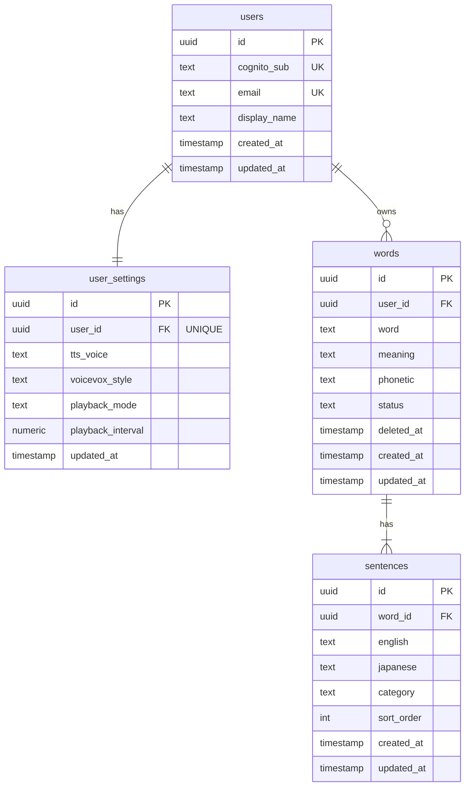

# DB設計書 — VOICEVOX TTS インフラ (AWS CDK) — Web版対応

**生成日**: 2026-03-20
**差分対象**: case1/aws/db-design.md からの変更点

---

> VOICEVOX TTS Lambda は**ステートレス**のため、TTS バックエンド自体のデータ設計は iOS版（case1/aws/db-design.md）と同一です。
>
> 本書では Web版で新たに追加が必要な **Web アプリ固有のデータ設計**（RDS PostgreSQL）を記載します。

---

## 1. AWS DBサービス選定

### TTS Lambda（iOS版と同一）

| サービス | 採用理由 |
|---------|---------|
| S3（フェーズ2 音声キャッシュ） | WAV ファイルの耐久性ある格納 |
| DynamoDB（フェーズ2 キャッシュメタデータ） | KV ルックアップのみ、スケール対応 |

### Web アプリバックエンド（新規追加）

| サービス | 採用理由 | 代替案 |
|---------|---------|--------|
| RDS PostgreSQL 16.x（t3.medium） | ユーザー・単語・例文の複雑なリレーション管理が必要。JOIN クエリが多い | Aurora Serverless v2（本番規模拡大時） |

---

## 2. ER図

> TTS Lambda のステートレス部分（audio_cache テーブル等）は case1/aws/db-design.md を参照。
> 本書では Web版のユーザーデータ管理テーブルのみ記載。



---

## 3. テーブル定義（Web版固有）

> 詳細なカラム定義は **case2/app/db-design.md** を参照してください。
> 本書では TTS インフラ観点からの追記事項を記載します。

### VOICEVOX TTS キャッシュとの連携

Web版では音声キャッシュをクライアント（IndexedDB）とサーバー（S3）の2層で管理します：

```
[ブラウザ IndexedDB] ← 高速（ローカル）
       ↓ キャッシュミス
[S3 + DynamoDB] ← フェーズ2 で追加（サーバー共有キャッシュ）
       ↓ キャッシュミス
[VOICEVOX Lambda] ← 実計算
```

**キャッシュキー**: `SHA256(text + "_" + speaker_id)`（iOS版・Web版で統一）

---

## 4. マイグレーション方針

iOS版インフラ（TTS Lambda）には DB マイグレーションは不要（ステートレス）。

Web アプリの RDS は **case2/app/db-design.md** の Alembic 運用方針に従う。

---

## 5. 設計上の判断・注意事項

- **Lambda と RDS の接続**: FastAPI Lambda から VPC 内の RDS に接続する場合、NAT Gateway（月額 ¥4,860 程度）が必要。Lambda を VPC に配置するとコールドスタートが増加するため、RDS Proxy の利用を検討すること
- **RDS Proxy の採用**: Lambda（コネクション数が多い）から RDS への接続は `RDS Proxy` 経由を推奨。コネクションプール管理が不要になり、Lambda の同時実行数が増えた際の RDS 接続枯渇を防げる
- **iOS版 VOICEVOX Lambda と Web版の共有**: 同一 Lambda を iOS アプリと React アプリで共有できる。レートリミット設定を環境別に管理すること
