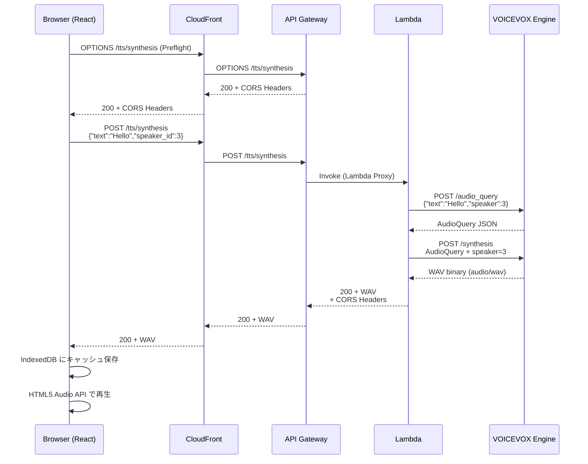
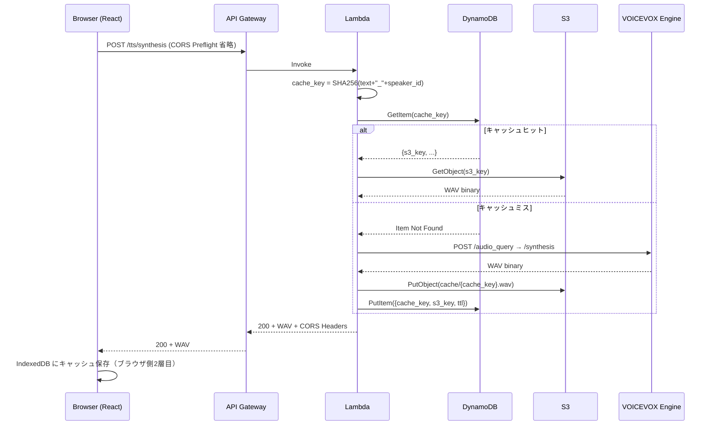
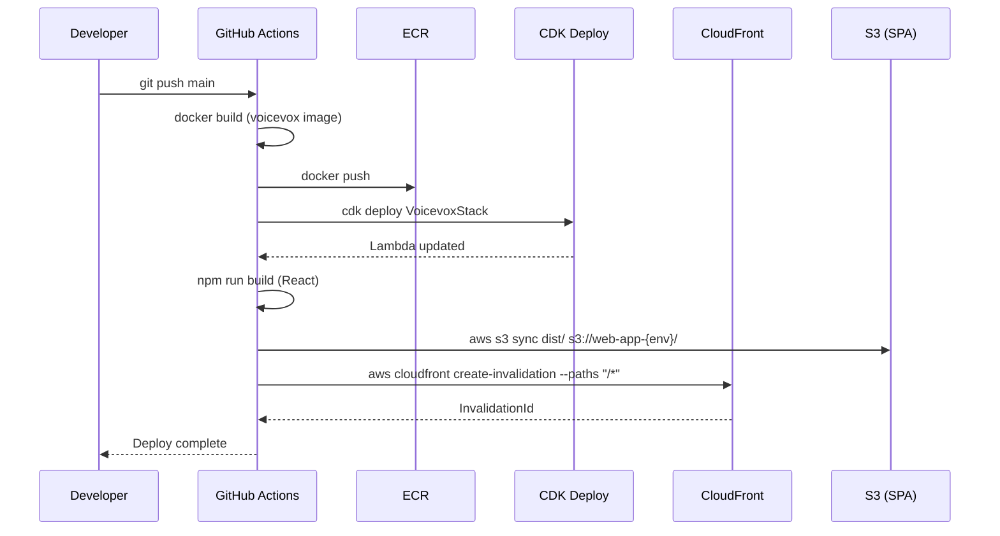

# 詳細設計書 — VOICEVOX TTS インフラ (AWS CDK) — Web版対応

**生成日**: 2026-03-20
**差分対象**: case1/aws/detail-design.md からの変更点

---

> Web版では iOS版と異なり、ブラウザ（React SPA）から直接 API Gateway を呼び出すため、**CORS 対応が必須**です。
> 本書では case1/aws/detail-design.md との差分（追加・変更点）を中心に記載します。

---

## 1. システム構成図（Web版）

```
[React SPA]
    │
    │ fetch() + CORS Preflight (OPTIONS)
    ▼
[CloudFront]
    │
    ├── /tts/* → [API Gateway HTTP API]
    │                  │
    │                  ▼
    │           [Lambda: voicevox-tts]
    │           (Container Image)
    │                  │
    │           [VOICEVOX Engine]
    │           (port 50021)
    │                  │
    │           └── Phase2: [S3 音声キャッシュ]
    │                        [DynamoDB メタデータ]
    │
    └── /* → [S3 Bucket (SPA hosting)]
```

---

## 2. シーケンス図

### 2-1. TTS 音声合成フロー（Web版・CORSあり）



### 2-2. TTS フロー（Phase2: S3キャッシュあり・Web版）



### 2-3. CI/CD デプロイフロー（Web版・CloudFront Invalidation追加）



---

## 3. API仕様（Web版追加・変更点）

### 3-1. CORS レスポンスヘッダー（全エンドポイント共通）

| ヘッダー | 値 | 備考 |
|---------|---|------|
| Access-Control-Allow-Origin | `https://{env}.example.com` | poc: `*`（開発時のみ） |
| Access-Control-Allow-Methods | `POST, OPTIONS` | GET は不要（POST のみ） |
| Access-Control-Allow-Headers | `Content-Type, x-api-key, Authorization` | |
| Access-Control-Max-Age | `86400`（1日） | Preflight キャッシュ |

### 3-2. POST /tts/synthesis（iOS版から変更なし・CORS追加）

**リクエスト**:
```json
{
  "text": "string",
  "speaker_id": 3
}
```

**レスポンス**: `audio/wav` バイナリ（変更なし）

**エラーレスポンス**:
```json
{
  "error": "string",
  "message": "string"
}
```

| ステータス | 条件 |
|-----------|------|
| 200 | 正常 |
| 400 | text が空、speaker_id が不正 |
| 429 | レートリミット超過（API Gateway throttling） |
| 500 | VOICEVOX エンジンエラー |
| 503 | Lambda コールドスタート タイムアウト |

### 3-3. OPTIONS /tts/synthesis（Web版新規追加）

**リクエスト**: Preflight（ブラウザ自動送信）

**レスポンス**:
```
HTTP/1.1 200 OK
Access-Control-Allow-Origin: https://{env}.example.com
Access-Control-Allow-Methods: POST, OPTIONS
Access-Control-Allow-Headers: Content-Type, x-api-key, Authorization
Access-Control-Max-Age: 86400
Content-Length: 0
```

---

## 4. CDK 実装差分（Web版固有）

### 4-1. CORS 設定（API Gateway HTTP API）

```typescript
// lib/stacks/voicevox-stack.ts

const httpApi = new apigwv2.HttpApi(this, 'VoicevoxHttpApi', {
  apiName: `voicevox-tts-${env}`,
  corsPreflight: {
    allowOrigins: corsAllowOrigins[env],   // 環境別オリジン
    allowMethods: [apigwv2.CorsHttpMethod.POST, apigwv2.CorsHttpMethod.OPTIONS],
    allowHeaders: ['Content-Type', 'x-api-key', 'Authorization'],
    maxAge: cdk.Duration.days(1),
  },
});

// 環境別 CORS オリジン設定
const corsAllowOrigins: Record<string, string[]> = {
  poc: ['*'],                                          // 開発用（全許可）
  dev: ['https://dev.englishlearn.example.com'],
  pro: ['https://englishlearn.example.com'],
};
```

### 4-2. CloudFront + S3 SPA ホスティング（WebAppStack）

```typescript
// lib/stacks/web-app-stack.ts

const spaBucket = new s3.Bucket(this, 'SpaBucket', {
  bucketName: `englishlearn-spa-${env}`,
  websiteIndexDocument: 'index.html',
  websiteErrorDocument: 'index.html',  // SPA のため全パスを index.html に
  blockPublicAccess: s3.BlockPublicAccess.BLOCK_ALL,
  removalPolicy: env === 'pro'
    ? cdk.RemovalPolicy.RETAIN
    : cdk.RemovalPolicy.DESTROY,
});

const distribution = new cloudfront.Distribution(this, 'SpaDistribution', {
  defaultBehavior: {
    origin: new origins.S3Origin(spaBucket),
    viewerProtocolPolicy: cloudfront.ViewerProtocolPolicy.REDIRECT_TO_HTTPS,
    cachePolicy: cloudfront.CachePolicy.CACHING_OPTIMIZED,
  },
  additionalBehaviors: {
    '/tts/*': {
      origin: new origins.HttpOrigin(`${httpApi.apiId}.execute-api.ap-northeast-1.amazonaws.com`),
      viewerProtocolPolicy: cloudfront.ViewerProtocolPolicy.HTTPS_ONLY,
      cachePolicy: cloudfront.CachePolicy.CACHING_DISABLED,   // 音声は毎回生成
      allowedMethods: cloudfront.AllowedMethods.ALLOW_ALL,    // OPTIONS 含む
    },
  },
});
```

---

## 5. 環境変数・設定値（Web版追加分）

| 変数名 | poc | dev | pro | 説明 |
|-------|-----|-----|-----|------|
| `CORS_ALLOW_ORIGINS` | `*` | `https://dev.englishlearn.example.com` | `https://englishlearn.example.com` | CORS 許可オリジン |
| `CLOUDFRONT_DISTRIBUTION_ID` | - | `E1XXXXXXXXXXXX` | `E2XXXXXXXXXXXX` | CloudFront ディストリビューション ID（GitHub Actions 用）|
| `SPA_BUCKET_NAME` | `englishlearn-spa-poc` | `englishlearn-spa-dev` | `englishlearn-spa-pro` | SPA ホスティング S3 バケット |

iOS版（case1/aws）の環境変数はそのまま継承。

---

## 6. テスト仕様（Web版追加）

### 6-1. CORS 結合テスト

```typescript
// test/cors.test.ts (Jest + aws-cdk-lib/assertions)

test('API Gateway HTTP API に CORS preflight 設定が存在する', () => {
  const template = Template.fromStack(stack);
  template.hasResourceProperties('AWS::ApiGatewayV2::Api', {
    CorsConfiguration: {
      AllowOrigins: Match.arrayWith(['https://englishlearn.example.com']),
      AllowMethods: Match.arrayWith(['POST', 'OPTIONS']),
      AllowHeaders: Match.arrayWith(['Content-Type']),
    },
  });
});

test('OPTIONS リクエストに 200 が返る（E2E）', async () => {
  const res = await fetch(`${API_URL}/tts/synthesis`, {
    method: 'OPTIONS',
    headers: {
      'Origin': 'https://englishlearn.example.com',
      'Access-Control-Request-Method': 'POST',
    },
  });
  expect(res.status).toBe(200);
  expect(res.headers.get('Access-Control-Allow-Origin'))
    .toBe('https://englishlearn.example.com');
});
```

### 6-2. ブラウザ fetch() 統合テスト（Playwright）

```typescript
// e2e/tts-cors.spec.ts

test('ブラウザから TTS API が呼び出せる', async ({ page }) => {
  await page.goto('https://dev.englishlearn.example.com');

  const [response] = await Promise.all([
    page.waitForResponse(res => res.url().includes('/tts/synthesis')),
    page.click('[data-testid="play-word-button"]'),
  ]);

  expect(response.status()).toBe(200);
  expect(response.headers()['content-type']).toContain('audio/wav');
  // CORS エラーがないことを確認
  const consoleErrors: string[] = [];
  page.on('console', msg => {
    if (msg.type() === 'error') consoleErrors.push(msg.text());
  });
  expect(consoleErrors.filter(e => e.includes('CORS'))).toHaveLength(0);
});
```

### 6-3. CloudFront Invalidation 確認テスト

```bash
# GitHub Actions 内での確認
aws cloudfront get-invalidation \
  --distribution-id $CLOUDFRONT_DISTRIBUTION_ID \
  --id $INVALIDATION_ID \
  --query 'Invalidation.Status' \
  --output text
# → "Completed" になるまで待機
```

---

## 7. 設計上の判断・注意事項（Web版追加）

- **CORS `*` は poc 環境のみ**: セキュリティ上、dev/pro 環境では特定オリジンのみ許可する。GitHub Pages や Vercel プレビュー URL を使う場合は都度追加が必要
- **CloudFront キャッシュと CORS**: CloudFront が CORS レスポンスヘッダーをキャッシュしないよう、`/tts/*` パスのキャッシュポリシーを `CACHING_DISABLED` に設定すること
- **Lambda 関数 URL（代替案）**: API Gateway の代わりに Lambda 関数 URL（CORS サポートあり）を使う選択肢もある。API Gateway より安価だが、WAF / レートリミット設定が限定的
- **OPTIONS メソッドへのコスト**: Preflight は毎回 Lambda を呼ばず API Gateway レベルで処理されるため、Lambda 実行コストは発生しない
- **iOS クライアントとの共存**: case1/aws と同一 Lambda を共有する場合、iOS からの呼び出しには CORS ヘッダーが返るが無視されるため問題なし。ただし API キー管理を環境別に行うこと
