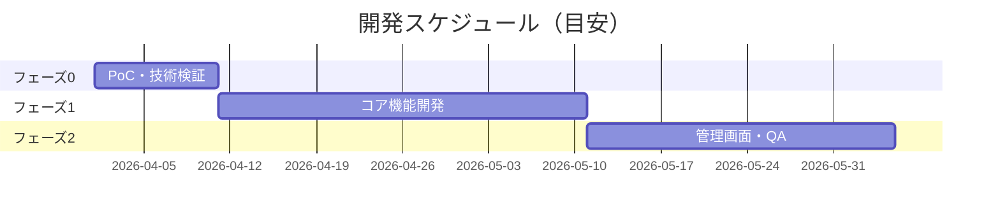

# proposal

## Description
`customer-summary.md`（req-estimate の出力）または要件定義書を受け取り、**経営者・意思決定者向けの提案書**（`proposal.md`）を生成するスキル。

技術的な話を排除し、「何が解決されるか」「いくらかかるか」「いつ終わるか」「何が心配か」を1ページで伝えることにフォーカスする。

## Trigger Conditions
次のような状況で必ず使うこと:
- 「提案書作って」「お客さんに見せる資料作って」「経営者向けにまとめて」
- 「費用・スケジュールをまとめたい」「意思決定に使う資料が欲しい」
- customer-summary.md を渡されて「これをもとに提案書を」と言われたとき
- req-estimate の後続工程として顧客提出用ドキュメントが必要なとき

---

## Steps

### Step 1: 入力を読み込み情報を抽出する

以下の優先順でファイルを読み込む：
1. `customer-summary.md`（req-estimate の出力）
2. `running-cost.md`（running-cost の出力）← あれば必ず読み込む
3. `design-doc.md`（アーキテクチャ詳細）
4. 元の要件定義書 / readme.md

以下の情報を抽出する：
```text
- システム名・解決したい課題
- 対応可否の判断（条件付き可能 / 可能 / 不可）
- 総工数・費用概算（人日 × 単価）
- フェーズ配分（フェーズ0/1/2 の期間・内容）
- 主要リスクと対策
- 技術的な前提条件・制約
```

### Step 2: 費用をビジネス言語に変換する

工数を「金額」と「期間」に変換する。単価が不明な場合は一般的な相場を使用する。

**単価の目安**（記載がない場合）：
```text
フリーランス:   7〜10万円/人日
受託開発会社:   8〜12万円/人日
```

**変換例**：
```text
54人日 × 10万円 = 540万円（税別）
バッファ込み 70人日 × 10万円 = 700万円（税別）
```

**ランニングコストの取り扱い**：
- `running-cost.md` が存在する場合 → その月額合計・年間TCOをそのまま転記する
- 存在しない場合 → 構成から概算を推定して記載する（「※詳細は別途 running-cost 算出を推奨」と注記）

### Step 3: Gantt チャートでスケジュールを可視化する

Mermaid の `gantt` 記法でフェーズスケジュールを作成する。



**Gantt 作成のルール**：
- フェーズ0 は必ず最初（PoC・リスク検証）
- 各フェーズの期間は工数（人日）÷ 想定メンバー数で算出
- 想定メンバー数が不明な場合は「2名体制」を仮定
- 開始日は「受注から1〜2週間後」を目安とする

### Step 4: リスクを経営者目線で整理する

技術的なリスクを「ビジネスへの影響」に言い換えて記載する。

| リスク（技術） | ビジネスへの影響 | 対策 |
|-------------|----------------|------|
| Bot検知によるアカウント停止 | サービス停止・追加費用が発生する可能性 | フェーズ0でPoC検証を先行実施 |

**深刻度の表現**（技術用語を使わない）：
- 🔴 高：プロジェクト中止・大幅追加費用の可能性あり
- 🟡 中：スケジュール遅延・軽微な追加費用の可能性あり
- 🟢 低：運用で対応可能

### Step 5: proposal.md を出力する

---

## Output Template

### proposal.md

```markdown
# 提案書 — {システム名}

**提案日**: {日付}
**提案先**: {顧客名（不明な場合は空欄）}
**提案者**: {空欄}

---

## エグゼクティブサマリー

{3〜4文で要約。「何を作るか」「何が解決されるか」「費用・期間」「最大のリスク」を含む。
技術用語は使わない。}

---

## 1. 解決する課題

**現状の問題**:
{箇条書きで現在の業務上の課題を記載。数値・時間・コストで表現できる場合は定量化する。}

**このシステムで実現すること**:
{課題がどう解決されるかを非技術者向けに記載。}

---

## 2. 提案内容

### システム概要

{1〜2段落。システムが何をするかを平易な言葉で説明。アーキテクチャ用語は避ける。}

### 開発フェーズ

| フェーズ | 内容 | 期間目安 | 成果物 |
|---------|------|---------|--------|
| フェーズ0 | PoC・技術検証 | {N週} | 技術的実現可否の確認 |
| フェーズ1 | コア機能開発 | {N週} | {主要機能} |
| フェーズ2 | {拡張機能・QA} | {N週} | {管理画面等} |

### スケジュール（目安）

```mermaid
gantt
    {Step 3 の Gantt}
```

---

## 3. 費用概算

### 初期開発費

| 項目 | 金額（税別） | 備考 |
|------|------------|------|
| 開発費（フェーズ0） | {N万円} | PoC・リスク検証 |
| 開発費（フェーズ1） | {N万円} | コア機能 |
| 開発費（フェーズ2） | {N万円} | 拡張機能・QA |
| **開発費 合計** | **{N万円}** | 税別、工数 {N}人日 |

### 月額ランニングコスト（稼働後）

| カテゴリ | 月額（目安） | 年額換算 |
|---------|------------|---------|
| AWSインフラ | {N万円} | {N万円} |
| 運用・保守 | {N万円} | {N万円} |
| 障害対応（想定） | {N万円} | {N万円} |
| **月額合計** | **{N万円}** | **{N万円}** |

### 3年間 TCO（参考）

| 費目 | 金額 |
|------|------|
| 初期開発費 | {N万円} |
| 運用費（3年分） | {N万円} |
| **3年間 TCO 合計** | **{N万円}** |

> 上記は概算です。詳細な要件確認後に正式見積もりを提出します。
> 開発単価は{N万円/人日}、運用工数単価は10万円/人日で試算しています。

---

## 4. リスクと対策

| リスク | ビジネスへの影響 | 深刻度 | 対策 |
|--------|----------------|--------|------|
{Step 4 の内容}

---

## 5. 前提条件・お願い事項

{プロジェクト開始前に顧客側で確認・準備が必要なことを記載。}
{例: PoC環境の提供、アカウント情報の共有、利用規約の確認 等}

---

## 6. 次のアクション

| # | アクション | 担当 | 期限目安 |
|---|----------|------|---------|
| 1 | 本提案内容のご確認・ご質問 | 顧客様 | {N営業日以内} |
| 2 | {investigation-report の最優先ヒアリング事項} | 顧客様 | 契約前 |
| 3 | 正式見積もり・契約書の締結 | 双方 | {N週以内} |
| 4 | フェーズ0 キックオフ | 双方 | 契約後1週間 |

---

*本提案書の内容は概算であり、詳細要件定義後に変更となる場合があります。*
```

---

## Quality Checklist

- [ ] 技術用語（ECS / Lambda / Playwright 等）が本文に出ていないか
- [ ] 費用が「人日」ではなく「万円」で表記されているか
- [ ] Gantt チャートが Mermaid で正しく描画されるか
- [ ] リスクがビジネス影響として記載されているか
- [ ] 「次のアクション」にinvestigation-reportの🔴項目が含まれているか
- [ ] エグゼクティブサマリーが3〜4文に収まっているか
- [ ] running-cost.md があれば月額・TCO が転記されているか
- [ ] ランニングコストに「AWSインフラ」「運用保守」「障害対応」の3項目があるか
- [ ] 3年間TCOが記載されているか
- [ ] 費用・TCOの数値がプレースホルダーではなく実数で埋まっているか
