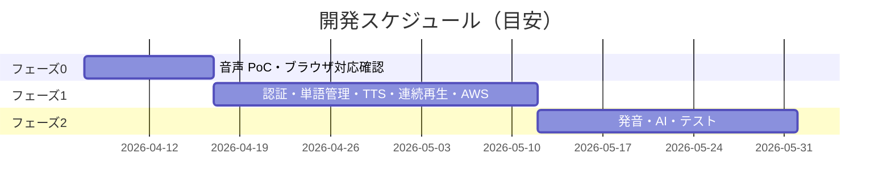

# 提案書 — EnglishLearnApp Web版

**提案日**: 2026-03-20
**提案先**:（空欄）
**提案者**:（空欄）

---

## エグゼクティブサマリー

iOS版英語学習アプリと同等の機能を Web ブラウザ上で実現するシステムのご提案です。スマートフォン・PC どちらからでもインストール不要でアクセスでき、単語データはクラウドで自動保存・複数デバイス間で同期されます。開発費の概算は **940万円（税別）、期間は約11週間（2〜3名体制）** で、毎月の維持費は約 **25万円** を見込んでいます。iOS版と比較して費用は増えますが、専用アプリのインストール不要・マルチデバイス対応・データクラウド保存という差別化価値を提供します。

---

## 1. 解決する課題

**iOS版に対する Web版の追加価値**:
- iOS（iPhone）をお持ちでない方も利用可能（PC・Android ブラウザからアクセス可能）
- アプリのインストール・アップデートが不要。URL を開くだけで最新版を利用できる
- iPhone を機種変更した際もデータが消えない（クラウドに自動保存）
- 複数デバイス（自宅の PC・外出先のスマートフォン）で同じ単語リストを利用できる
- App Store 審査なしでアップデートを即時反映できる

**現状の問題（iOS版との課題を踏まえて）**:
- iOS 専門エンジニアが必要で採用・維持コストが高い
- データがデバイスに閉じているため、機種変更時のデータ移行が煩雑
- Apple の審査プロセスにより、緊急バグ修正も 1〜2 週間待機が発生しうる

**このシステムで実現すること**:
- ブラウザだけで英単語管理 → AI 例文生成 → ずんだもん音声で聴き流し → 発音チェックまでを完結できる
- Google アカウント不要。メールアドレスで登録し、どのデバイスからでも同じデータを使える

---

## 2. 提案内容

### システム概要

ブラウザで動作する英語学習アプリです。英単語を登録すると AI（OpenAI）が例文を自動作成し、ずんだもんの声で読み上げてくれます。マイクで発音してみるとアプリが「正解率」を判定します。登録した単語はクラウドに保存されるため、スマートフォンとパソコンで同じ単語リストを共有できます。なお、発音チェック機能は Chrome・Edge ブラウザのみ対応しています。

### 開発フェーズ

| フェーズ | 内容 | 期間目安 | 成果物 |
|---------|------|---------|--------|
| フェーズ0 | 音声サービス検証・ブラウザ対応確認 | 2週間 | 技術的実現可否レポート |
| フェーズ1 | ログイン・単語管理・音声再生・連続再生・AWS 基盤 | 5週間 | 基本機能が使える状態の Web アプリ（MVP） |
| フェーズ2 | 発音チェック・AI 例文生成・設定・全テスト | 4週間 | 完成版 Web アプリ |

### スケジュール（目安）

---

## 3. 費用概算

### 初期開発費

| 項目 | 金額（税別） | 備考 |
|------|------------|------|
| 開発費（フェーズ0） | 80万円 | PoC・技術リスク検証（8人日） |
| 開発費（フェーズ1） | 470万円 | 認証・単語管理・TTS・連続再生（47人日） |
| 開発費（フェーズ2） | 220万円 | 発音・AI・テスト（22人日） |
| バッファ（25%） | 170万円 | 仕様変更・リスク対応（17人日） |
| **開発費 合計** | **940万円** | 税別、工数 94人日 |

### iOS版との費用比較

| 項目 | iOS版（case1） | Web版（本案） | 差分 |
|------|-------------|-----------|------|
| 開発費 | 660万円 | 940万円 | +280万円（+42%） |
| 月額運用費 | 18.9万円 | 24.7万円 | +5.8万円/月 |
| 3年間 TCO | 1,340万円 | 1,829万円 | +489万円 |
| iOS 専門エンジニア | 必要 | 不要 | コスト差あり |

### 月額ランニングコスト（稼働後）

| カテゴリ | 月額（目安） | 年額換算 |
|---------|------------|---------|
| AWSインフラ | 1.4万円 | 16.8万円 |
| 運用・保守 | 18.0万円 | 216.0万円 |
| 障害対応（想定） | 5.5万円 | 66.0万円 |
| **月額合計** | **24.9万円** | **298.8万円** |

### 3年間 TCO（参考）

| 費目 | 金額 |
|------|------|
| 初期開発費 | 940万円 |
| 運用費（3年分） | 893万円（¥24.9万 × 36ヶ月） |
| **3年間 TCO 合計** | **1,833万円** |

> 上記は概算です。詳細な要件確認後に正式見積もりを提出します。開発単価は10万円/人日で試算しています。

---

## 4. リスクと対策

| リスク | ビジネスへの影響 | 深刻度 | 対策 |
|--------|----------------|--------|------|
| 発音チェックが Safari で使えない | Safari ユーザーが発音チェック機能を利用できない | 🟡 中 | Chrome / Edge 限定バナーを表示し、誘導。将来的には第三者音声認識 API で補完 |
| 音声サーバーの起動待ち（10〜30秒） | 最初の音声再生に時間がかかる | 🟡 中 | フェーズ0 で許容範囲を確認。問題なら常時起動型に変更 |
| データベース障害（RDS 停止） | アプリ全体が使えなくなる | 🟡 中 | 自動バックアップ（毎日）・CloudWatch アラームで即時検知 |
| ユーザーデータの誤削除 | ユーザーの学習データが失われる | 🟢 低 | ソフトデリート（10日間復元可能）＋バックアップで二重保護 |

---

## 5. 前提条件・お願い事項

- OpenAI API キーはお客様ご自身でご用意いただく必要があります（月額利用料はお客様負担）
- フェーズ0開始前に AWS アカウントへのアクセス権（CDK Bootstrap 実行権限）をご提供ください
- 発音チェック機能のテストには Chrome または Edge のご使用をお願いします

---

## 6. 次のアクション

| # | アクション | 担当 | 期限目安 |
|---|----------|------|---------|
| 1 | 本提案内容のご確認・ご質問 | お客様 | 5営業日以内 |
| 2 | iOS版との並行運用方針の確認（データ共有の有無） | お客様 | 契約前 |
| 3 | VOICEVOX ずんだもん商用利用規約の確認 | お客様 | 契約前 |
| 4 | 対象ブラウザ（Safari 対応有無）の合意 | お客様・弊社 | 契約前 |
| 5 | 正式見積もり・契約書の締結 | 双方 | 合意後2週間以内 |
| 6 | フェーズ0 キックオフ | 双方 | 契約後1週間 |

---

*本提案書の内容は概算であり、詳細要件定義後に変更となる場合があります。*
