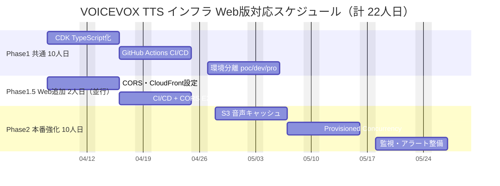

# 提案書 — VOICEVOX TTS インフラ Web版対応 (AWS CDK)

**作成日**: 2026-03-20
**対象**: EnglishLearnApp Web版 — VOICEVOX TTS インフラ改修

---

## エグゼクティブサマリー

iOS版で稼働中の VOICEVOX TTS Lambda インフラに、**最小限の改修（+2人日）**でブラウザ（React SPA）からのアクセスを可能にします。iOS版の堅牢なインフラ資産をそのまま活用し、CORS 設定と CloudFront SPA ホスティングを追加するだけで、Web版サービスを実現できます。

| 項目 | 内容 |
|------|------|
| 対応可否 | **対応可能**（追加工数2人日） |
| 追加開発費 | **¥200,000**（2人日 × 10万円） |
| 追加月額運用費 | **¥13,500/月**（CloudFront + S3 + CORS運用） |
| 3年間追加TCO | **¥686,000**（iOS版比+9%） |
| リスク | 低（既存インフラの設定追加のみ）  |

---

## iOS版との差分一覧

| 変更点 | iOS版 | Web版 | 工数 |
|-------|------|------|------|
| API Gateway CORS 設定 | 不要（ネイティブHTTPクライアント） | **必須**（`corsAllowOrigins` 追加） | 0.5人日 |
| OPTIONS Preflight 対応 | 不要 | **必須**（自動生成） | 0人日（CDK自動） |
| CloudFront + S3 SPA ホスティング | 不要 | **追加**（WebAppStack） | 1.0人日 |
| CI/CD に CloudFront Invalidation 追加 | 不要 | **追加**（GitHub Actions step） | 0.3人日 |
| CORS E2E テスト追加 | 不要 | **追加**（Playwright） | 0.2人日 |
| **合計** | | | **2.0人日** |

---

## フェーズ計画

### フェーズ1（既存）: CDK 整備・CI/CD（iOS版と同一）

Week 1-2 で実施。10人日。iOS版（case1/aws）と完全共通のため、Web版対応における追加工数はなし。

| タスク | 工数 |
|-------|------|
| CDK TypeScript 化 | 4人日 |
| GitHub Actions CI/CD 整備 | 3人日 |
| 環境分離（poc/dev/pro） | 3人日 |
| **合計** | **10人日** |

### フェーズ2（既存）: 本番運用強化（iOS版と同一）

Week 3-4 で実施。10人日。iOS版と共通。

| タスク | 工数 |
|-------|------|
| S3 音声キャッシュ実装 | 4人日 |
| Provisioned Concurrency 検討・設定 | 3人日 |
| 監視・アラート整備 | 3人日 |
| **合計** | **10人日** |

### フェーズ1.5（Web版追加）: CORS・CloudFront 対応

フェーズ1と**並行して** Day 1-2 で完了。追加工数 2人日のみ。

| タスク | 工数 |
|-------|------|
| CDK CORS 設定追加（`corsAllowOrigins`） | 0.5人日 |
| CloudFront + S3 SPA ホスティング（WebAppStack） | 1.0人日 |
| CI/CD CloudFront Invalidation 追加 | 0.3人日 |
| CORS E2E テスト（Playwright） | 0.2人日 |
| **合計** | **2.0人日** |

### ガントチャート（Web版統合）

---

## コスト比較

### 初期開発費

| 項目 | iOS版（case1/aws） | Web版（case2/aws） |
|------|-----------------|-----------------|
| CDK 基盤整備 | 10人日 | 10人日（共通） |
| 本番運用強化 | 15人日 | 15人日（共通） |
| **Web版追加** | — | **2人日** |
| **合計** | **25人日 / ¥2,500,000** | **27人日 / ¥2,700,000** |

### 月額運用費（本番・Provisioned Concurrencyなし）

| カテゴリ | iOS版 | Web版 | 差分 |
|---------|------|------|------|
| AWSインフラ | ¥3,000 | ¥4,500 | +¥1,500 |
| 運用・保守 | ¥100,000 | ¥110,000 | +¥10,000 |
| 障害対応 | ¥35,000 | ¥37,000 | +¥2,000 |
| **月額合計** | **¥138,000** | **¥151,500** | **+¥13,500** |

### 3年間 TCO 比較

| | iOS版 TTS インフラ | Web版 TTS インフラ | 差分 |
|--|-----------------|-----------------|------|
| 初期開発費 | ¥2,500,000 | ¥2,700,000 | +¥200,000 |
| 運用費（3年） | ¥4,968,000 | ¥5,454,000 | +¥486,000 |
| **3年間合計** | **¥7,468,000** | **¥8,154,000** | **+¥686,000（+9.2%）** |

> **投資対効果**: Web版対応追加コストは3年で¥686,000（月¥19,000相当）。Web版ユーザーが月10名以上利用すれば、ユーザー1人あたり月¥1,900以下となり十分な費用対効果が見込めます。

---

## リスク評価

| リスク | 影響度 | 発生確率 | 対策 |
|-------|--------|---------|------|
| CORS 設定ミスによるブラウザブロック | 高 | 低 | 環境別テスト自動化 |
| CloudFront キャッシュによるコンテンツ不整合 | 中 | 中 | デプロイ後 Invalidation 必須化 |
| iOS版と Web版の API キー共用リスク | 中 | 低 | 環境別 API キー管理 |
| Lambda コールドスタート（10〜30秒）のブラウザ影響 | 中 | 高 | ローディング UI / IndexedDB キャッシュ対策 |
| Safari での CORS 制限（一部バージョン） | 低 | 低 | Chrome/Edge 推奨を UI で案内 |

---

## 推奨事項

**推奨オプション: Web版対応（+2人日）**

iOS版インフラへの最小限の追加投資で Web版を実現できます。既存 Lambda・API Gateway・CDK 資産をそのまま活用するため、技術的リスクが低く、iOS版と Web版の運用を一元管理できます。

**次のステップ**:
1. iOS版 Phase1 CDK 整備と並行して Web版 CORS・CloudFront 対応（Phase1.5）を実施
2. `poc` 環境で React SPA + VOICEVOX API の CORS 動作確認
3. `dev` 環境でオリジン設定を本番ドメインに切り替えてテスト
4. `pro` 環境への段階的リリース

---

## 参考資料

- [case1/aws] iOS版 TTS インフラ 詳細設計書
- [case2/app] Web版アプリ 詳細設計書（FastAPI・React・RDS）
- [case2/aws/detail-design.md] Web版 TTS インフラ 詳細設計書
- [case2/aws/running-cost.md] Web版 TTS インフラ 運用コスト試算
