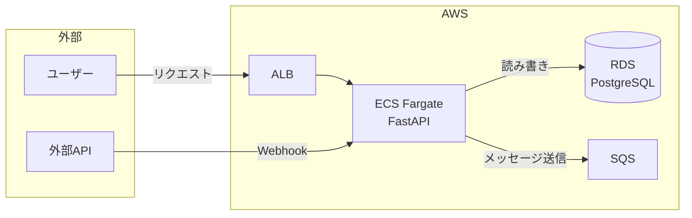

# 要件見積もり・実現可否判断スキル

顧客から受け取った要件定義書（readme.md 等）をもとに、以下を素早く判断・出力するスキルです。

## 前提となる技術スタック

このスキルは以下のスタックを使う開発者向けに最適化されています:
- **フロントエンド**: React（最新安定版）+ TypeScript + React Router（最新安定版）+ Tailwind CSS（最新安定版）
- **バックエンド**: Python（最新安定版）+ FastAPI
- **データベース**: PostgreSQL（最新安定版、AWS RDS サポート済み）
- **インフラ**: AWS（ECS Fargate, Lambda, Cognito 等）
- **対象領域**: Webアプリ, インフラ構築

> **バージョン選定の方針**:
> 1. 設計書を生成する前に、各ライブラリ・ランタイムの **現時点の最新安定版** を WebSearch で確認してから記載すること
>    - 例: `"React latest stable version 2025"` / `"AWS RDS PostgreSQL supported versions"`
> 2. 確認できた場合は具体的なバージョン番号（例: `React 19.x`）を設計書に明記する
> 3. 顧客側の制約（既存システムとの互換性等）がある場合のみバージョンをダウングレードし、その旨を明記すること

## 実行手順

### ステップ1: 要件の読み取り・整理

要件ファイルを受け取ったら、まず以下の観点で内容を整理してください:

- **機能要件**: 何を作るか（画面・API・処理など）
- **非機能要件**: パフォーマンス、セキュリティ、スケーラビリティなど
- **技術制約**: 使用技術・連携システム・データ形式など
- **不明点・曖昧な箇所**: 判断に影響する不確定要素

### ステップ2: 技術的実現可否の判断

以下の軸で判断し、明確に「**対応可能 / 条件付き対応可能 / 対応困難**」のいずれかを示してください:

| 判断 | 基準 |
|------|------|
| 対応可能 | React/Python/AWS の標準的な実装で実現できる |
| 条件付き対応可能 | 追加調査・技術選定が必要、または要件の明確化が必要 |
| 対応困難 | スタック外の技術が必要・リスクが高い・要件が不明確すぎる |

リスクが高い箇所には必ず理由を添えること（「〇〇の部分が未知のため追加調査が必要」など）。

### ステップ3: 工数見積もり

`references/estimation-guide.md` を参照して、各機能・フェーズごとの工数（人日）を見積もってください。

工数の出し方:
- 機能・コンポーネント単位に分解する
- 各コンポーネントに楽観/通常/悲観の3点見積もりを使う（通常値をベースに）
- **テスト工数を必ず個別に計上する**（estimation-guide.md セクション6 を参照）
  - 単体テスト・結合テスト・E2E/システムテストを分けて見積もる
  - 外部サービス連携・Playwright 等の脆弱な自動化が含まれる場合はテスト工数を多めに取る
  - テスト環境構築（CI 組み込み・テスト用 DB 等）も別行で計上すること
- 合計に **バッファ 20〜30%** を加算する（テスト工数含む合計に対して加算）
- 合計工数と「〇〇人で〇週間」の換算を示す

### ステップ4: 設計方針の立案

高レベルのアーキテクチャ方針を簡潔に示してください:
- フロントエンド構成（React + TypeScript）
- バックエンド構成（Python: FastAPI / Lambda / Batch 等）
- AWS インフラ構成（使用サービスと役割）
- データ設計の概要（主要エンティティ）

複雑すぎる場合は「フェーズ1 / フェーズ2」に分割することも検討してください。

### ステップ4.5: アーキテクチャ図の作成（Mermaid）

設計書に必ず **Mermaid 形式のアーキテクチャ図を1枚** 含めてください。図はシステム全体のデータフロー・コンポーネント関係を一目で把握できるものにします。

**図の方針**:
- `flowchart LR`（左→右）を基本とする。縦に長くなる場合は `flowchart TB`（上→下）でも可
- 外部システム（ユーザー・外部API・SaaS）→ AWS サービス → DB/ストレージ の流れを示す
- コンポーネントは役割でグループ化する（`subgraph` を活用）
- 矢印には処理の内容を短く添える（例: `-->|新着メッセージ取得|`）
- 1枚に収める。詳細すぎず、全体像が伝わる粒度を意識する

**Mermaid スタイル例**（参考）:


### ステップ5: 2つのドキュメントを生成

以下の2つのファイルを必ず生成してください。

---

## 出力ファイル1: 顧客向けサマリー `customer-summary.md`

**目的**: 顧客へのヒアリング・回答・提案に使う、非技術者でも読めるドキュメント

### テンプレート

```markdown
# 要件確認・対応方針 — [プロジェクト名]

## 対応可否
**[対応可能 / 条件付き対応可能 / 対応困難]**

[1〜2文で結論を述べる]

## ご要件の理解
[受け取った要件の要約を3〜5箇条で。顧客が「そう、そういうこと」と思えるように]

## 提案する進め方
[フェーズ分け・優先順位・MVP（最初にリリースする範囲）を示す]

## 概算工数・スケジュール感
| フェーズ | 内容 | 概算工数 |
|---------|------|---------|
| フェーズ1 | ... | 〇人日 |
| フェーズ2 | ... | 〇人日 |
| **合計** | | **〇人日（〇人 × 〇週間）** |

※ 上記は概算です。詳細ヒアリング後に確定見積もりをご提示します。

## 確認させてください（不明点・前提条件）
[判断に必要な確認事項を箇条書きで。顧客に答えてもらう質問形式にする]

## リスク・注意点
[技術リスク・スコープリスクを平易な言葉で]
```

---

## 出力ファイル2: 実装者向け設計書 `design-doc.md`

**目的**: 開発者が実装を始めるための設計方針書

### テンプレート

```markdown
# 設計書 — [プロジェクト名]

## 概要
[要件の技術的要約。何を作るか1段落で]

## 技術的実現可否
**判断: [対応可能 / 条件付き対応可能 / 対応困難]**

[判断の根拠と、リスクがあれば詳細を記述]

## アーキテクチャ図

```mermaid
[システム全体のデータフロー図をここに記述]
```

## アーキテクチャ方針

### フロントエンド
- 技術: React（最新安定版）+ TypeScript + React Router（最新安定版）+ Tailwind CSS（最新安定版）
  - ※ バージョンは WebSearch で確認した最新値を記載すること（例: React 19.x, React Router v7, Tailwind CSS v4）
- [コンポーネント構成・状態管理・ルーティングの方針]

### バックエンド
- 技術: Python（最新安定版）+ [FastAPI / Lambda / 等]
  - ※ バージョンは WebSearch で確認した最新値を記載すること（例: Python 3.13）
- [API設計・ビジネスロジックの方針]

### インフラ（AWS）
- [使用サービス一覧と役割]
- [ネットワーク・セキュリティ方針]

### データ設計
- [主要エンティティとその関係]

## 機能一覧と工数見積もり

| # | 機能 | 内容 | 工数（人日） | 備考 |
|---|------|------|-------------|------|
| 1 | | | | |
| ... | | | | |
| | **実装 小計** | | | |
| T1 | 単体テスト | バックエンド API・ロジック（pytest） | | |
| T2 | 結合テスト | API + DB / 外部サービス連携 | | |
| T3 | E2E / システムテスト | 主要フロー（Playwright or pytest E2E） | | |
| T4 | テスト環境構築 | CI 組み込み・Docker Compose・シードデータ | | |
| | **テスト 小計** | | | |
| | **合計（実装 + テスト）** | | | |
| | **バッファ（25%）** | | | |
| | **総合計** | | **〇人日** | |

## フェーズ計画
[フェーズ分けと各フェーズのスコープ・優先度]

## 不明点・確認事項
[実装前に確認が必要な技術的不明点のリスト]

## リスク・考慮事項
[技術リスク・依存関係・注意事項]
```

---

## 品質チェックリスト

出力前に以下を確認してください:

- [ ] 実現可否の判断が明確（曖昧でない）
- [ ] 工数に各機能の内訳がある（合計だけでない）
- [ ] **テスト工数（単体・結合・E2E・環境構築）が個別行で計上されている**
- [ ] バッファ（20〜30%）が加算されている
- [ ] 不明点・リスクが具体的に書かれている
- [ ] 顧客サマリーが非技術者にも読める言葉になっている
- [ ] 設計書が実装者が次のアクションを取れるレベルになっている
- [ ] **Mermaid アーキテクチャ図が design-doc.md に含まれている**

## 出力場所

生成したファイルはワークスペースフォルダに保存すること:
- `customer-summary.md`
- `design-doc.md`
