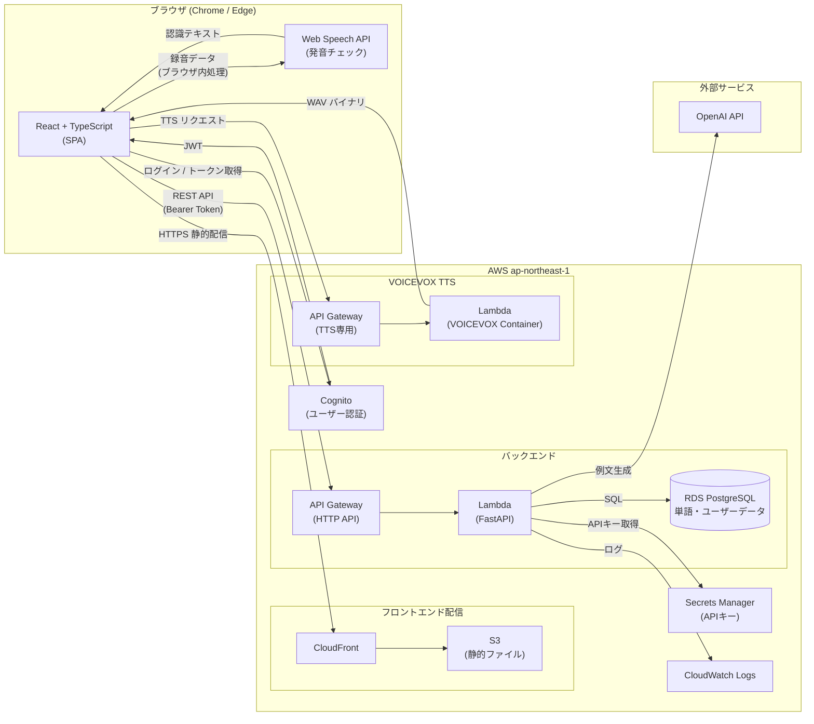

# 設計書 — EnglishLearnApp Web版

**作成日**: 2026-03-20
**参考**: iOS版設計書（case1/app/design-doc.md）のWeb版移植

---

## 概要

iOS版 EnglishLearnApp を React + TypeScript（フロントエンド）/ Python FastAPI（バックエンド）/ AWS（インフラ）の標準スタックで再実装したWeb版。OpenAI 例文生成・VOICEVOX TTS（AWS Lambda 経由）・Web Speech API による発音判定をブラウザ上で実現し、単語データは RDS PostgreSQL に保存してマルチデバイス同期を標準対応とする。

---

## 技術的実現可否

**判断: 対応可能**

Web版は弊社標準スタック（React/TypeScript + Python/FastAPI + AWS）で完全対応可能。iOS専門エンジニア不要。主な設計上の注意点は以下：

- **Web Speech API**: 発音チェックは Chrome / Edge のみ対応（Safari 非対応）
- **VOICEVOX コールドスタート**: iOS版と同様の課題（フェーズ0 で許容値を確認）
- **OpenAI API キー**: Web版ではバックエンド経由で呼び出し、クライアントに秘密情報を持たせない設計を採用

---

## アーキテクチャ図

---

## アーキテクチャ方針

### フロントエンド（React + TypeScript）

- **フレームワーク**: React 19 + TypeScript 5.x（Vite でビルド）
- **ルーティング**: React Router v7
- **状態管理**: Zustand（グローバル状態）+ TanStack Query（サーバー状態・キャッシュ）
- **UI ライブラリ**: shadcn/ui + Tailwind CSS
- **音声再生**: HTML5 `<audio>` + Web Audio API（連続再生キュー）
- **TTS（ネイティブ）**: Web Speech API `SpeechSynthesisUtterance`（Chrome/Edge/Safari）
- **発音チェック**: Web Speech API `webkitSpeechRecognition`（Chrome/Edge のみ）
- **ロック画面連携**: Media Session API（Chrome/Edge でサポート）
- **デプロイ**: CloudFront + S3（静的ファイルホスティング）

### バックエンド（Python / FastAPI）

- **フレームワーク**: FastAPI（Python 3.12）
- **ORM**: SQLAlchemy 2.x + Alembic（マイグレーション）
- **認証**: AWS Cognito JWT 検証（`python-jose`）
- **実行環境**: AWS Lambda（Mangum アダプタ）または ECS Fargate
- **OpenAI 呼び出し**: バックエンド経由（クライアントに API キーを持たせない）
- **VOICEVOX 呼び出し**: フロントエンドから直接 TTS API Gateway を叩く（バイナリ転送の効率化）

### インフラ（AWS）

| サービス | 役割 |
|---------|------|
| CloudFront + S3 | React SPA 静的ファイル配信 |
| API Gateway（HTTP API） | FastAPI バックエンドへのルーティング |
| Lambda（Mangum）または ECS Fargate | FastAPI アプリケーション実行 |
| RDS PostgreSQL 16.x（t3.medium） | ユーザー・単語・例文データ永続化 |
| Cognito User Pool | メール/パスワード認証・JWT 発行 |
| Secrets Manager | OpenAI API キー管理 |
| API Gateway（TTS 専用）+ Lambda | VOICEVOX TTS バックエンド（iOS版と共通） |
| GitHub Actions + CDK | CI/CD・インフラ管理 |

### データ設計の概要

| エンティティ | 概要 |
|-------------|------|
| users | Cognito sub をキーとするユーザー情報 |
| words | 英単語・日本語訳・発音記号・ステータス（active/archived/deleted） |
| sentences | 例文（英語・日本語・カテゴリ）、Word 1:N |
| prompt_presets | OpenAI プロンプトプリセット（最大 10 件） |
| audio_cache | VOICEVOX 生成音声のキャッシュメタデータ |

---

## 機能一覧と工数見積もり

| # | 機能 | 内容 | 工数（人日） | 備考 |
|---|------|------|-------------|------|
| **フロントエンド** | | | | |
| 1 | 認証 UI | ログイン・新規登録・パスワードリセット画面 | 3 | Cognito Hosted UI または自前 |
| 2 | 単語管理 UI | リスト・追加・編集・アーカイブ・ゴミ箱（スワイプ → キーボードショートカット） | 5 | レスポンシブ対応含む |
| 3 | 検索・フィルタ・ソート | 全文検索・頭文字フィルタ・カテゴリ・ソート | 2 | TanStack Query でキャッシュ |
| 4 | TTS 再生（ネイティブ） | Web Speech API（デフォルト/女性/男性） | 2 | |
| 5 | VOICEVOX 連携 | TTS API 呼び出し・音声キャッシュ（IndexedDB） | 3 | コールドスタート UX 含む |
| 6 | 発音チェック UI | Web Speech API 録音・判定表示（Chrome/Edge 限定バナー表示） | 4 | |
| 7 | 連続再生プレイヤー | HTML5 Audio キュー・ミニプレイヤー・フルプレイヤー・ドラッグ並び替え | 6 | |
| 8 | Media Session 連携 | ブラウザ/OS のメディアコントロールと連携 | 2 | |
| 9 | OpenAI 例文生成 UI | 単語入力 → 「例文を生成」→ フォーム自動入力 | 2 | バックエンド API 経由 |
| 10 | プロンプトプリセット管理 | 最大 10 件・組み込み+カスタム | 1 | |
| 11 | 設定画面 | 音声種別・再生設定・VOICEVOX スタイル | 2 | |
| 12 | JSON エクスポート/インポート | ダウンロード + ファイルアップロード UI | 2 | iOS版との互換性維持 |
| **バックエンド** | | | | |
| 13 | FastAPI 基盤 | プロジェクト構成・DB 接続・Cognito 認証ミドルウェア | 2 | |
| 14 | 認証 API | Cognito 連携・JWT 検証 | 2 | |
| 15 | 単語管理 CRUD API | `/words` CRUD・アーカイブ・ゴミ箱・復元 | 3 | |
| 16 | 例文管理 API | `/sentences` CRUD | 1 | |
| 17 | OpenAI 例文生成 API | `/generate` → OpenAI structured output | 2 | Secrets Manager 経由 |
| 18 | プロンプトプリセット API | `/presets` CRUD | 1 | |
| 19 | JSON エクスポート/インポート API | 単語データの一括取得・インポート | 2 | iOS版フォーマット互換 |
| **AWS インフラ** | | | | |
| 20 | CloudFront + S3（フロントエンド） | SPA 配信・カスタムドメイン・HTTPS | 2 | |
| 21 | Lambda（Mangum）+ API Gateway | FastAPI 実行環境 | 2 | |
| 22 | RDS PostgreSQL セットアップ | t3.medium・VPC・セキュリティグループ | 2 | |
| 23 | Cognito User Pool 設定 | メール認証・パスワードポリシー | 1 | |
| 24 | CI/CD（GitHub Actions + CDK） | フロント + バック + Lambda の自動デプロイ | 3 | |
| 25 | マルチ環境（dev/stg/pro） | CDK で3環境管理 | 2 | |
| | **実装 小計** | | **57** | |
| T1 | 単体テスト（フロントエンド） | React Testing Library（主要コンポーネント） | 4 | |
| T2 | 単体テスト（バックエンド） | pytest（API ロジック・OpenAI モック） | 4 | |
| T3 | 結合テスト | API + DB（Docker Compose）/ Cognito モック | 4 | |
| T4 | E2E テスト | Playwright（主要フロー：ログイン→単語追加→TTS→発音チェック） | 4 | |
| T5 | テスト環境構築 | GitHub Actions CI・Docker Compose・シードデータ | 2 | |
| | **テスト 小計** | | **18** | |
| | **合計（実装 + テスト）** | | **75** | |
| | **バッファ（25%）** | | **19** | |
| | **総合計** | | **94人日** | |

> **修正**: 詳細積み上げにより customer-summary の 85人日より若干増加。正式見積もりでの確定値として扱ってください。

---

## フェーズ計画

| フェーズ | スコープ | 工数 | 優先度 |
|---------|---------|------|--------|
| フェーズ0 | VOICEVOX / Web Speech API PoC・技術スタック確定 | 8人日 | 最高（リスク検証） |
| フェーズ1 MVP | 機能 #1〜5, #7, #13〜25（認証・単語管理・TTS・連続再生・AWS 基盤） | 47人日 | 高 |
| フェーズ2 | 機能 #6, #8〜12 + テスト全体（発音・AI・Export/Import） | 39人日 | 中 |

---

## 不明点・確認事項

1. **Safari 対応**: Web Speech API が Safari 非対応のため、発音チェック機能を Safari ユーザーに対してどう扱うか（非表示 / 代替手段）
2. **Cognito vs 自前 JWT**: Cognito はセットアップが速いが、カスタマイズに限界あり。自前 JWT（python-jose + RDS）と比較して選定する
3. **Lambda vs ECS Fargate（FastAPI）**: FastAPI をどちらで動かすか。コールドスタート許容範囲次第
4. **iOS版との JSON 互換**: case1/app の iOS版と同じ JSON 形式（`meaning`, `english`, `japanese` キー）でエクスポートし、両版間でデータ移行できるようにするか
5. **モバイルブラウザ対応**: スマートフォンブラウザでのレスポンシブ対応範囲（PC 優先 or モバイルファースト）

---

## リスク・考慮事項

- **Web Speech API のブラウザ互換**: Chrome/Edge のみ対応。Safari ユーザーは発音チェックが使えない。`SpeechRecognition` の標準化が進めば今後改善の余地あり
- **VOICEVOX コールドスタート**: iOS版と同様（フェーズ0 で検証）
- **CORS 設定**: VOICEVOX TTS API Gateway に React アプリのドメインを CORS 許可リストに追加する必要あり
- **IndexedDB 音声キャッシュ**: iOS版の FileManager キャッシュに相当。ブラウザの IndexedDB に WAV を保存するが、ブラウザのストレージ制限（通常 50MB〜）に注意
