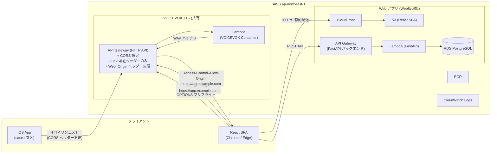

# 設計書 — VOICEVOX TTS インフラ (AWS CDK) — Web版対応

**作成日**: 2026-03-20
**差分対象**: case1/aws/design-doc.md からの変更点を中心に記載

---

## 概要

iOS版 VOICEVOX TTS インフラ（case1/aws）を Web ブラウザ（React SPA）からも呼び出せるよう、CORS 設定とプリフライトリクエスト対応を追加した CDK スタック。基本構成（Lambda Container + API Gateway + CDK TypeScript）は iOS版と同一。主な変更は CORS 許可オリジンの管理方法とブラウザ統合テストの追加。

---

## 技術的実現可否

**判断: 対応可能（iOS版インフラへの差分追加のみ）**

ブラウザからの TTS API 呼び出しは標準的な CORS 対応で実現可能。追加実装は CDK スタックの `corsAllowOrigins` 更新とプリフライトテストのみ。

---

## アーキテクチャ図



---

## アーキテクチャ方針

### iOS版からの変更点のみ記載（共通部分は case1/aws/design-doc.md を参照）

#### CORS 設定の変更

```typescript
// CDK スタック（VoicevoxStack.ts）の変更部分
const api = new apigateway.HttpApi(this, 'VoicevoxApi', {
  corsPreflight: {
    // iOS版: allowOrigins: ['*'] (PoC) → Web版 dev/pro: 特定ドメインに制限
    allowOrigins: props.corsAllowOrigins,
    allowMethods: [
      apigateway.CorsHttpMethod.GET,
      apigateway.CorsHttpMethod.POST,
      apigateway.CorsHttpMethod.OPTIONS,  // ← プリフライト対応に必要
    ],
    allowHeaders: [
      'Content-Type',
      'x-api-key',          // API Key 認証用
      'Authorization',      // 将来の Cognito 対応
    ],
    maxAge: cdk.Duration.days(1),  // プリフライトキャッシュ
  },
});
```

#### 環境別 CORS 設定

| 環境 | corsAllowOrigins | 備考 |
|------|----------------|------|
| poc | `['*']` | iOS PoC + ローカル開発（`localhost:5173`）両対応 |
| dev | `['https://dev.app.example.com', 'http://localhost:5173']` | React dev サーバー含む |
| pro | `['https://app.example.com']` | 本番ドメインのみ |

### 新規追加コンポーネント（Web版 app インフラ）

Web版では TTS Lambda に加え、以下のインフラが新たに必要です（CDK で同一リポジトリで管理推奨）：

| コンポーネント | CDK スタック | 備考 |
|-------------|-----------|------|
| CloudFront + S3（React SPA） | `WebAppStack` | 新規 |
| API Gateway + Lambda（FastAPI） | `ApiStack` | 新規 |
| RDS PostgreSQL | `DatabaseStack` | 新規 |
| Cognito User Pool | `AuthStack` | 新規 |

> スタック分割推奨: `VoicevoxStack`（TTS、iOS版と共有）+ `WebAppStack`（Web版固有）

---

## 機能一覧と工数見積もり（iOS版インフラからの差分）

| # | 機能 | 内容 | 追加工数（人日） | 備考 |
|---|------|------|--------------|------|
| 1 | CORS 設定更新 | CDK corsAllowOrigins を環境別に設定 | 0.5 | |
| 2 | OPTIONS プリフライト動作確認 | curl / ブラウザから OPTIONS リクエストのテスト | 0.5 | |
| 3 | ブラウザ統合テスト | Chrome/Edge から fetch() でTTS 呼び出し確認 | 1 | |
| 4 | CloudFront + S3（React SPA） | 静的ファイルホスティング CDK 定義 | 2 | 新規スタック |
| 5 | API Gateway + Lambda（FastAPI） | バックエンド API 実行環境 CDK 定義 | 2 | 新規スタック |
| 6 | RDS PostgreSQL セットアップ | VPC・セキュリティグループ・バックアップ | 2 | 新規スタック |
| 7 | Cognito User Pool 設定 | メール認証・パスワードポリシー | 1 | 新規スタック |
| 8 | CI/CD 更新（フロントエンド追加） | React ビルド → S3 デプロイ の GitHub Actions ジョブ追加 | 1 | |
| | **Web版対応 追加合計** | | **10人日** | iOS版の25人日に加算 |

> iOS版インフラ（25人日）と合わせると、Web版対応インフラ全体は **35人日** となります。

---

## フェーズ計画

| フェーズ | スコープ | 工数 |
|---------|---------|------|
| フェーズ1（iOS版共通） | CDK 整備・CI/CD・監視・認証（case1/aws参照） | 11人日 |
| フェーズ1（Web版追加） | CORS 更新・ブラウザテスト・CloudFront/S3/RDS/Cognito | 10人日 |
| フェーズ2 | S3 キャッシュ・コールドスタート対策 | 10人日 |
| バッファ（20%） | | 6人日 |
| **合計** | | **37人日** |

---

## 不明点・確認事項

1. **iOS版と Web版の Lambda 共有**: VOICEVOX Lambda を iOS版・Web版で共有しますか？（レートリミット・コストへの影響）
2. **ローカル開発環境の CORS**: `localhost:5173`（Vite dev server）を dev 環境の CORS に含めますか？
3. **本番ドメイン**: React SPA の本番ドメイン（例: `https://app.example.com`）は確定していますか？

---

## リスク・考慮事項

- **CORS 設定の先行確認**: ブラウザから fetch() でリクエストすると、レスポンスに `Access-Control-Allow-Origin` ヘッダーがない場合に CORS エラーで失敗します。dev 環境への最初のデプロイ後、必ずブラウザでの動作確認を実施すること
- **OPTIONS プリフライトのキャッシュ**: `maxAge: 1日` に設定することで、ブラウザが OPTIONS リクエストを毎回送らないようにしパフォーマンスを改善する
- **WAV ファイルの CORS 対応**: `/synthesis` エンドポイントは `Content-Type: audio/wav` を返すため、`Access-Control-Expose-Headers` に `Content-Type` を含めること
